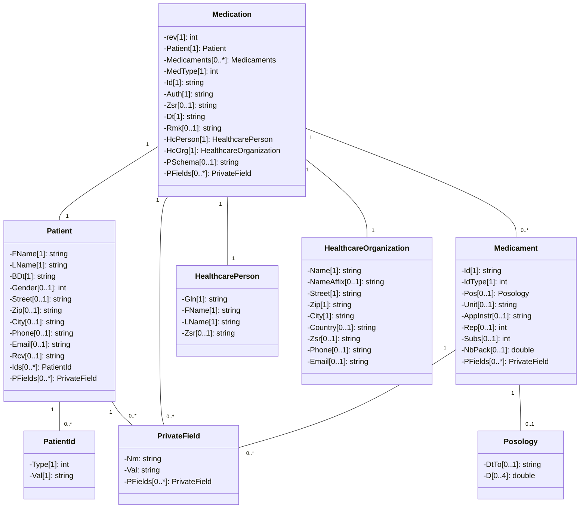

# CHMED16A - Prescription (Revision 2)

**Contact**

Geschäftsstelle IG eMediplan<br>
c/o Köhler, Stüdeli & Partner GmbH<br>
Amthausgasse 18, 3011 Bern<br>
Tel. +41 (0)31 560 00 24<br>
info@emediplan.ch

## Table of Contents

- [Table of Contents](#table-of-contents)
- [Introduction](#introduction)
    - [Revisions](#revisions)
- [Medication object](#medication-object)
    - [Overview of the object model](#chmed16a-emedication-object)
    - [Using JSON as the object model format](#using-json-as-the-object-model-format)
    - [Object model](#object-model)
    - [Encapsulation of the JSON medication object](#encapsulation-of-the-json-medication-object)

## Introduction

Medication plans are a central pillar of any eHealth solution. To enable interoperability between eHealth systems in Switzerland, the organisation "[IG eMediplan](https://emediplan.ch/)" was founded in 2016. Its aim is to support and provide public, open source, medication plan formats used by a broad group of stakeholders from the public and private sectors. 

This paper describes the currently proposed specification and reference implementation of the object model for an electronic prescription, the so-called CHMED16A - Prescription.

> [!IMPORTANT]
> This is the specification for using CHMED16A in the context of prescriptions.
> As prescriptions share a lot of similarities with medication plans,
> most of the fields/entities are shared with the [medication plan specification](./README.md).

This document is the content and layout specification for the electronic document, a string/text file containing a header such as "CHMED16A1" and the (compressed, encoded) medication plan as a JSON object in UTF-8 (see [ChTransmissionFormat](../chtransmissionformat/README.md)).

This allows IT systems to store and transmit electronic medication plans as simple strings or text files in UTF-8. It also makes it possible to transmit the medication in a print-based form by using 2D barcodes. Therefore, the medication plan is readable by users and systems alike. This is necessary to guarantee a simple handling. 

### Revisions

The object model contains an attribute `rev` (short for revision) on the root level (medication object).
It designates which revision of this specification is used.
Revisions allow to introduce changes to the specification
with no direct impact to existing implementations.
Revision numbers start at 1 and increase with new revisions.

For this to work, the following guideline for implementers is important:

> [!IMPORTANT]
> Parsers MUST ignore unknown fields and not fail if any are encountered.
> 
> Serializers SHOULD NOT include unknown fields.

A new revision must be able to be parsed by a parser only supporting an older revision.
In other words, a document of a certain revision must be valid
if validated against each prior revision (and the assigned revision itself).

This means a new revision can

- Add a new field (whether as required or optional)
- Remove an optional field
- Narrow the cardinality of a field, e.g. make a field required which was optional previously
- Narrow the type of a field, e.g. change a string to a URL

On the other hand, it cannot

- Remove a required field
- Relax the cardinality, e.g. make a required field optional
- Change the type of a field to either a broader version or an incompatible one
  (e.g. change a URL to a string or a string to an integer)

## Medication object

### Overview of the object model

The hierarchy of the object model is quite simple. Each medication object includes:

```
1 Medication (the current prescription)
  1 Patient
    n Identifiers (a number of identifiers/numbers/codes to connect the patient to IT systems)
  n Medicaments (all currently used medicaments)
    n Posology (the dosage information)
  1 HealthcarePerson
  1 HealthcareOrganization
```

### Using JSON as the object model format

The object model format is [JSON](https://en.wikipedia.org/wiki/JSON), which was chosen for its openness, flexibility, simplicity and language independence. JSON can be implemented for most programming languages and platforms. The JSON format uses human-readable text, so patient data is clearly identifiable, making the JSON format easy to use for documentation, development and integration. 

*As the number of primary types supported by JSON is very small, we make intensive use of strings in combination with a specific format, e.g. dates or posology. During serialization, the cost of tags is quite high; therefore we have chosen rather short field names. We recommend to omit optional fields when they are null or empty.* 

### Object model



#### Medication (Med)

The *Med* object is the main one; it contains exactly one *Patient* object and at least one *Medicament* object.  

<table>
<tr>
  <th rowspan="2"><b>Name</b></th>
  <th rowspan="2"><b>Type</b></th>
  <th rowspan="2"><b>Since revision</b></th>
  <th><b>Usage</b></th>
  <th rowspan="2"><b>Description</b></th>
</tr>
<tr>
  <td>Rx</td>
</tr>
<tr>
  <td>rev</td>
  <td>number</td>
  <td>2</td>
  <td>R</td>
  <td>

  The [revision number](#revisions) of the specification used.
  If no revision number is specified, it is assumed it uses revision 1
  (as the explicit and required revision number has been introduced in revision 2).

  </td>
</tr>
<tr>
  <td>Patient</td>
  <td><i>Patient</i></td>
  <td>1</td>
  <td>

  R[^1]

  </td>
  <td>

  The patient. Please refer to [Patient](#patient)

  </td>
</tr>
<tr>
  <td>Medicaments</td>
  <td>

  list of [Medicament](#medicament)

  </td>
  <td>1</td>
  <td>0-N</td>
  <td>

  The list of medicaments. Please refer to [Medicament](#medicament)

  </td>
</tr>
<tr>
  <td>MedType</td>
  <td>number</td>
  <td>1</td>
  <td>R</td>
  <td>
    <p>The type of the <i>Medication</i> object Possible values: </p>
    <p>3: Prescription (Rx) </p>
  </td>
</tr>
<tr>
  <td>Id</td>
  <td>string</td>
  <td>1</td>
  <td>R</td>
  <td>

  The ID of the <i>Medication</i> object

  This MUST be a globally unique identifier, e.g. a UUID.

  </td>
</tr>
<tr>
  <td>Auth</td>
  <td>string</td>
  <td>1</td>
  <td>R</td>
  <td>

  Author (GLN[^3] if available, otherwise name)

  eMediplan: GLN of a person or organisation

  ePrescription: GLN of a person

  The patient can also be the author of the eMediplan. In this case, the minimum requirement is that the term
  "patient" is used to designate the author. Optionally, the patient's first name, last name and date of birth can also be specified additionally.

  Note that the GLN provided in this field MUST also be provided in [HealthcarePerson](#healthcareperson) for revision 2+.

  </td>
</tr>
<tr>
  <td>Zsr</td>
  <td>string</td>
  <td>1</td>
  <td>

  O[^2]

  </td>
  <td>

  ZSR ([Zahlstellenregister](https://www.sasis.ch/de/Angebot/Produkt/ProductDetail?topMenuId=447)) number of the author or their organisation

  </td>
</tr>
<tr>
  <td>Dt</td>
  <td>string</td>
  <td>1</td>
  <td>R</td>
  <td>

  Date of creation, Format: yyyy-mm-ddThh:mm:ss+02:00 ([ISO 8601](https://en.wikipedia.org/wiki/ISO_8601) Combined date and time in UTC) (e.g. 2016-01-16T16:26:15+02:00)

  </td>
</tr>
<tr>
  <td>Rmk</td>
  <td>string</td>
  <td>1</td>
  <td>O</td>
  <td>
    Remark (any information/advice the author would like to share independently of a specific medicament)
  </td>
</tr>
<tr>
  <td>HcPerson</td>
  <td><i>HealthcarePerson</i></td>
  <td>2</td>
  <td>R</td>
  <td>

  The healthcare person (the author of the document)

  Please refer to [HealthcarePerson](#healthcareperson).

  </td>
</tr>
<tr>
  <td>HcOrg</td>
  <td><i>HealthcareOrganization</i></td>
  <td>2</td>
  <td>R</td>
  <td>

  The healthcare organization in which the <i>HealthcarePerson</i> works.

  Please refer to [HealthcareOrganization](#healthcareorganization).

  </td>
</tr>
<tr>
  <td>PSchema</td>
  <td>string</td>
  <td>1</td>
  <td>

  O

  </td>
  <td>The schema of the private fields. When empty or not specified, all private fields must be ignored.</td>
</tr>
<tr>
  <td>PFields</td>
  <td>

  list of [Private Field](#private-field)

  </td>
  <td>1</td>
  <td>0-N</td>
  <td>

  The list of private fields. Please refer to [Private Field](#private-field)

  </td>
</tr>
</table>

#### Patient

<table>
<tr>
  <th rowspan="2"><b>Name</b></th>
  <th rowspan="2"><b>Type</b></th>
  <th rowspan="2"><b>Since revision</b></th>
  <th><b>Usage</b></th>
  <th rowspan="2"><b>Description</b></th>
</tr>
<tr>
  <td>Rx</td>
</tr>
<tr>
  <td>FName</td>
  <td>string</td>
  <td>1</td>
  <td>R</td>
  <td>First name</td>
</tr>
<tr>
  <td>LName</td>
  <td>string</td>
  <td>1</td>
  <td>R</td>
  <td>Last name</td>
</tr>
<tr>
  <td>BDt</td>
  <td>string</td>
  <td>1</td>
  <td>R</td>
  <td>

  Date of birth, Format: yyyy-mm-dd ([ISO 8601](https://en.wikipedia.org/wiki/ISO_8601) Date)

  </td>
</tr>
<tr>
  <td>Gender</td>
  <td>number</td>
  <td>1</td>
  <td>O</td>
  <td>

  Gender of patient

  Possible values

  1: Male

  2: Female

  </td>
</tr>
<tr>
  <td>Street</td>
  <td>string</td>
  <td>1</td>
  <td>O</td>
  <td>Street</td>
</tr>
<tr>
  <td>Zip</td>
  <td>string</td>
  <td>1</td>
  <td>O</td>
  <td>Zip code</td>
</tr>
<tr>
  <td>City</td>
  <td>string</td>
  <td>1</td>
  <td>O</td>
  <td>City</td>
</tr>
<tr>
  <td>Phone</td>
  <td>string</td>
  <td>1</td>
  <td>O</td>
  <td>Phone number</td>
</tr>
<tr>
  <td>Email</td>
  <td>string</td>
  <td>1</td>
  <td>O</td>
  <td>E-mail address</td>
</tr>
<tr>
  <td>Rcv</td>
  <td>string</td>
  <td>1</td>
  <td>O</td>
  <td>Receiver (GLN) of the electronic prescription. To be used if the electronic prescription is to be transmitted
    electronically to a healthcare professional.
  </td>
</tr>
<tr>
  <td>Ids</td>
  <td>
 
  list of [PatientId](#patientid)
 
  </td>
  <td>1</td>
  <td>0-N</td>
  <td>
 
  The list of patient identifiers. Please refer to [PatientId](#patientid)
 
  </td>
</tr>
<tr>
  <td>PFields</td>
  <td>
 
  list of [Private Fields](#private-field)
 
  </td>
  <td>1</td>
  <td>0-N</td>
  <td>
 
  The list of private fields. Please refer to [Private Fields](#private-field)
 
  </td>
</tr>
</table>

#### PatientId


<table>
<tr>
  <th rowspan="2"><b>Name</b></th>
  <th rowspan="2"><b>Type</b></th>
  <th rowspan="2"><b>Since revision</b></th>
  <th><b>Usage</b></th>
  <th rowspan="2"><b>Description</b></th>
</tr>
<tr>
  <td>Rx</td>
</tr>
<tr>
  <td>Type</td>
  <td>number</td>
  <td>1</td>
  <td>R</td>
  <td>

  Type of the ID

  Possible values

  1: Insurance card number

  </td>
</tr>
<tr>
  <td>Val</td>
  <td>string</td>
  <td>1</td>
  <td>R</td>
  <td>The ID value</td>
</tr>
</table>

#### Medicament

<table>
<tr>
  <th rowspan="2"><b>Name</b></th>
  <th rowspan="2"><b>Type</b></th>
  <th rowspan="2"><b>Since revision</b></th>
  <th><b>Usage</b></th>
  <th rowspan="2"><b>Description</b></th>
</tr>
<tr>
  <td>Rx</td>
</tr>
<tr>
  <td>Id</td>
  <td>string</td>
  <td>1</td>
  <td>R</td>
  <td>

  The ID defined in the _IdType_ below. If `IdType = None` then free text description.

  </td>
</tr>
<tr>
  <td>IdType</td>
  <td>number</td>
  <td>1</td>
  <td>R</td>
  <td><p>The type of the <i>Id</i>. Possible values:</p><p>1: None </p>
    <p>2: GTIN </p>
    <p>3: Pharmacode </p>
    <p>4: Product number (not for Rx) </p></td>
</tr>
<tr>
  <td>Pos</td>
  <td>

  list of [Posology](#posology)

  </td>
  <td>1</td>
  <td>0-1</td>
  <td>

  The list of posologies. Please refer to [Posology](#posology)

  </td>
</tr>
<tr>
  <td>Unit</td>
  <td>string</td>
  <td>1</td>
  <td>O</td>
  <td>

  The quantity unit. Mandatory if _Pos_ is defined.
  (The unit must be based on the standardized substance in the INDEX database.)

  Possible values: [CDTYP 9](https://index.hcisolutions.ch/index/current/get.aspx?schema=CODE&keytype=CDTYP&key=9) in INDEX database/CODE schema

  </td>
</tr>
<tr>
  <td>AppInstr</td>
  <td>string</td>
  <td>1</td>
  <td>O</td>
  <td>Application instructions (further information on how to apply the medication, e.g. take before meals)</td>
</tr>
<tr>
  <td>Rep</td>
  <td>number</td>
  <td>1</td>
  <td>O</td>
  <td>Integer which defines the number of repetitions in months, e.g. permanent prescription for 6 months</td>
</tr>
<tr>
  <td>Subs</td>
  <td>number</td>
  <td>1</td>
  <td>O</td>
  <td>1 if medicament should not be substituted, 0 otherwise. Default: 0</td>
</tr>
<tr>
  <td>NbPack</td>
  <td>number</td>
  <td>1</td>
  <td>O</td>
  <td>Number of packages to be delivered. Default: 1</td>
</tr>
<tr>
  <td>PFields</td>
  <td>

  list of [Private Fields](#private-field)

  </td>
  <td>1</td>
  <td>0-N</td>
  <td>

  The list of private fields. Please refer to [Private Fields](#private-field)

  </td>
</tr>
</table>

#### Posology

<table>
<tr>
  <th rowspan="2"><b>Name</b></th>
  <th rowspan="2"><b>Type</b></th>
  <th rowspan="2"><b>Since revision</b></th>
  <th><b>Usage</b></th>
  <th rowspan="2"><b>Description</b></th>
</tr>
<tr>
  <td>Rx</td>
</tr>
<tr>
  <td>DtTo</td>
  <td>string</td>
  <td>1</td>
  <td>O</td>
  <td>

  To date (end date of medication treatment),
  Format: yyyy-mm-dd ([ISO 8601](https://en.wikipedia.org/wiki/ISO_8601) Date).
  The _DtTo_ must be considered as inclusive. For example DtTo: 2015-05-01, the patient must apply the medicament also on 2015-05-01.

  </td>
</tr>
<tr>
  <td>D</td>
  <td>list of number</td>
  <td>1</td>
  <td>0-4</td>
  <td>

  Simplified version of taking times.
  Describes the doses to be applied in the morning, at noon, in the evening and at night.

  </td>
</tr>
</table>

#### Private Field

<table>
<tr>
  <th rowspan="2"><b>Name</b></th>
  <th rowspan="2"><b>Type</b></th>
  <th rowspan="2"><b>Since revision</b></th>
  <th><b>Usage</b></th>
  <th rowspan="2"><b>Description</b></th>
</tr>
<tr>
  <td>Rx</td>
</tr>
<tr>
  <td>Nm</td>
  <td>string</td>
  <td>1</td>
  <td>R</td>
  <td>The name of the field</td>
</tr>
<tr>
  <td>Val</td>
  <td>string</td>
  <td>1</td>
  <td>O</td>
  <td>The value of the field</td>
</tr>
<tr>
  <td>PFields</td>
  <td>

  list of [Private Fields](#private-field)

  </td>
  <td>1</td>
  <td>0-N</td>
  <td>The list of private fields</td>
</tr>
</table>

#### HealthcarePerson

<table>
<tr>
  <th rowspan="2"><b>Name</b></th>
  <th rowspan="2"><b>Type</b></th>
  <th rowspan="2"><b>Since revision</b></th>
  <th><b>Usage</b></th>
  <th rowspan="2"><b>Description</b></th>
</tr>
<tr>
  <td>Rx</td>
</tr>
<tr>
  <td>Gln</td>
  <td>string</td>
  <td>2</td>
  <td>R</td>
  <td>The GLN</td>
</tr>
<tr>
  <td>FName</td>
  <td>string</td>
  <td>2</td>
  <td>R</td>
  <td>First name</td>
</tr>
<tr>
  <td>LName</td>
  <td>string</td>
  <td>2</td>
  <td>R</td>
  <td>Last name</td>
</tr>
<tr>
  <td>Zsr</td>
  <td>string</td>
  <td>2</td>
  <td>O</td>
  <td><p>ZSR number</p>
    <p>The ZSR number may only be set once, either in object <i>HealthcarePerson</i> or in object <i>HealthcareOrganization</i>.
    </p></td>
</tr>
</table>

#### HealthcareOrganization

<table>
<tr>
  <th rowspan="2"><b>Name</b></th>
  <th rowspan="2"><b>Type</b></th>
  <th rowspan="2"><b>Since revision</b></th>
  <th><b>Usage</b></th>
  <th rowspan="2"><b>Description</b></th>
</tr>
<tr>
  <td>Rx</td>
</tr>
<tr>
  <td>Name</td>
  <td>string</td>
  <td>2</td>
  <td>R</td>
  <td>Name</td>
</tr>
<tr>
  <td>NameAffix</td>
  <td>string</td>
  <td>2</td>
  <td>O</td>
  <td>Additional name, e.g. department within the organization</td>
</tr>
<tr>
  <td>Street</td>
  <td>string</td>
  <td>2</td>
  <td>R</td>
  <td>Street</td>
</tr>
<tr>
  <td>Zip</td>
  <td>string</td>
  <td>2</td>
  <td>R</td>
  <td>Postcode</td>
</tr>
<tr>
  <td>City</td>
  <td>string</td>
  <td>2</td>
  <td>R</td>
  <td>City</td>
</tr>
<tr>
  <td>Country</td>
  <td>string</td>
  <td>2</td>
  <td>O</td>
  <td>

  Country

  If the address is in Switzerland, this property does not need to be set, as it is assumed by default that the address is in Switzerland.

  Format: Alpha-2 code ([ISO 3166](https://www.iso.org/iso-3166-country-codes.html) Country Codes)

  (e.g. FR for France)

  </td>
</tr>
<tr>
  <td>Zsr</td>
  <td>string</td>
  <td>2</td>
  <td>O</td>
  <td><p>ZSR number</p>
    <p>The ZSR number may only be set once, either in object <i>HealthcarePerson</i> or in object <i>HealthcareOrganization</i>.
    </p></td>
</tr>
<tr>
  <td>Phone</td>
  <td>string</td>
  <td>2</td>
  <td>O</td>
  <td>Phone number</td>
</tr>
<tr>
  <td>Email</td>
  <td>string</td>
  <td>2</td>
  <td>O</td>
  <td>E-mail address</td>
</tr>
</table>

### Encapsulation of the JSON medication object

To encapsulate and transmit the JSON object, [ChTransmissionFormat](../chtransmissionformat/README.md) should be used.
Note that CHMED16A (the JSON described in this specification) does not contain a version marker
which is only included in ChTransmissionFormat
as one of the main goals is to keep the content as compact as possible.
Therefore, if CHMED16A is transmitted without being wrapped in ChTransmissionFormat,
the version needs to be transferred in another way.

[^1]: R: Required
[^2]: O: Optional
[^3]: Global Location Number (GLN): [https://www.refdata.ch/de/partner/abfrage](https://www.refdata.ch/de/partner/abfrage)
