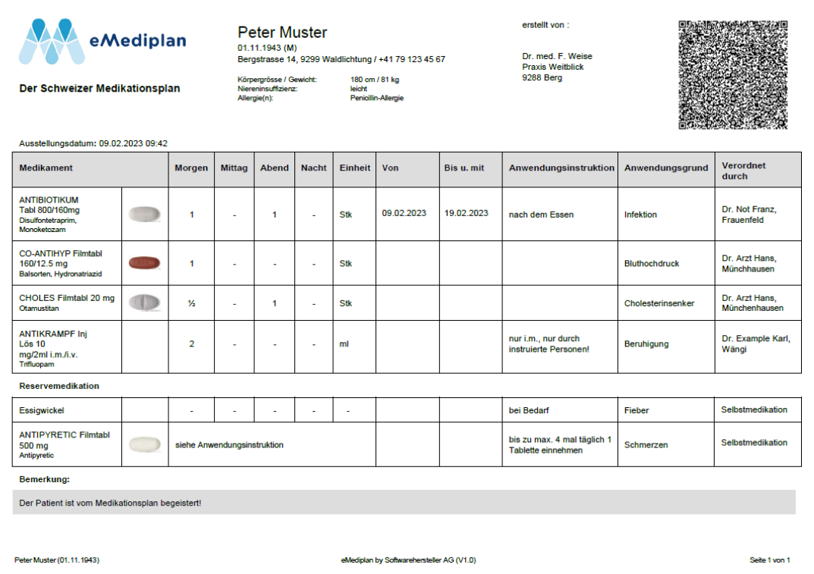
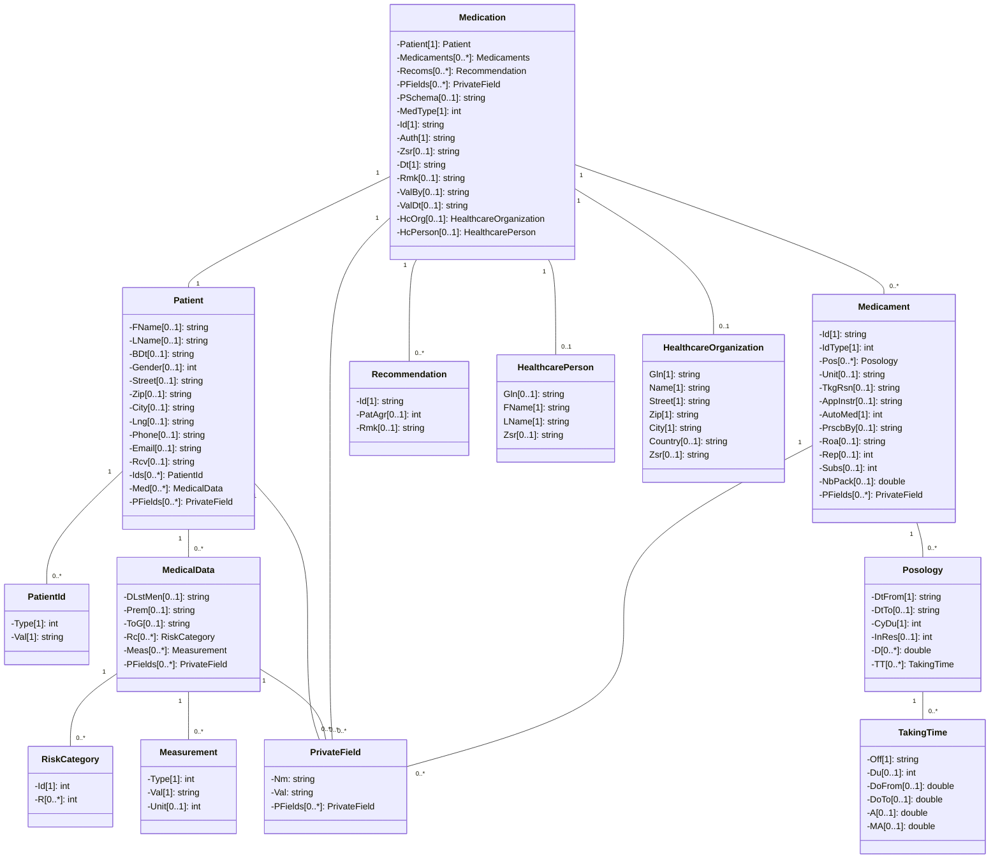
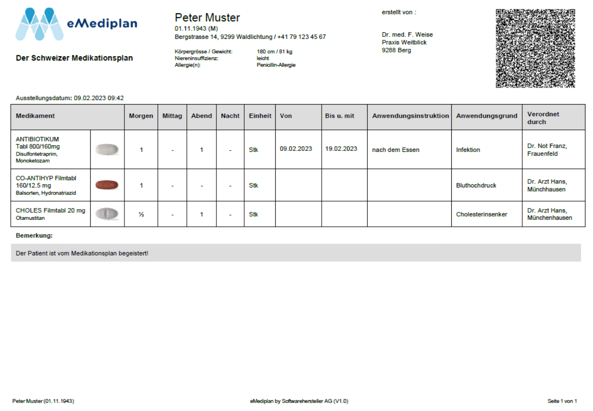
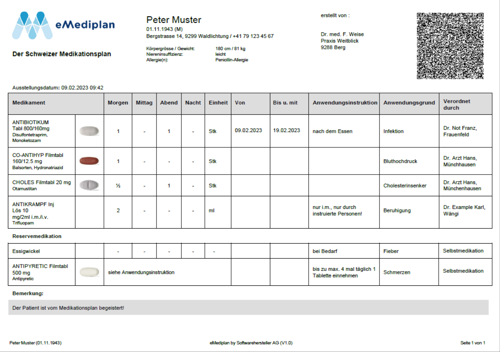
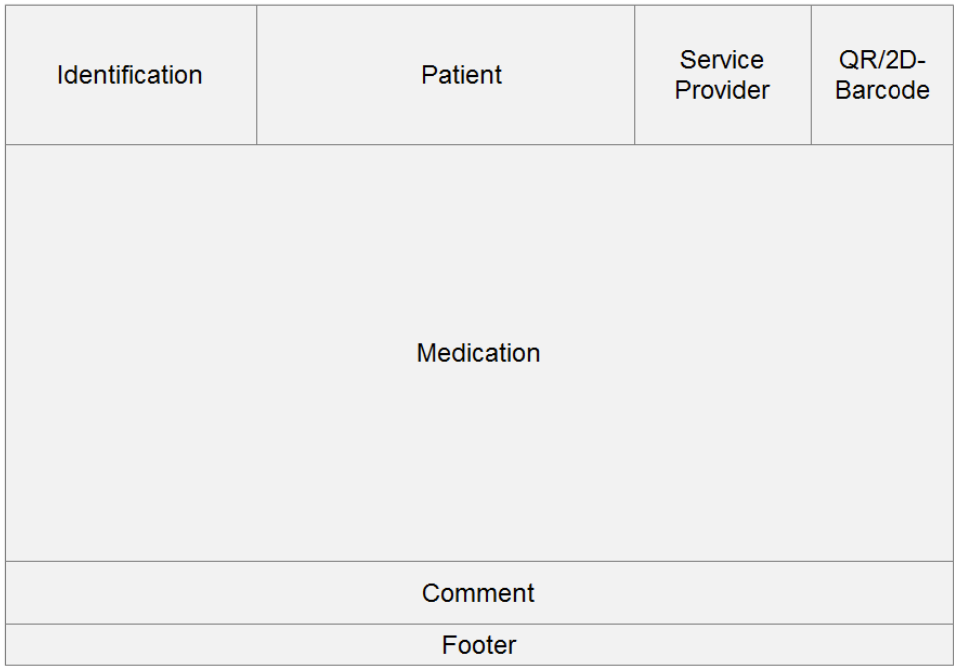

# eMedication Plan CHMED16R

**Contact**

Geschäftsstelle IG eMediplan<br>
c/o Köhler, Stüdeli & Partner GmbH<br>
Amthausgasse 18, 3011 Bern<br>
Tel. +41 (0)31 560 00 24<br>
info@emediplan.ch

## Table of Contents

- [Table of Contents](#table-of-contents)
- [Introduction](#introduction)
- [CHMED16R eMedication object](#chmed16r-emedication-object)
    - [Overview of the object model](#chmed16r-emedication-object)
    - [Using JSON as the object model format](#using-json-as-the-object-model-format)
    - [Object model](#object-model)
    - [Example of a JSON medication object](#example-of-a-json-medication-object)
    - [Encapsulation of the JSON medication object](#encapsulation-of-the-json-medication-object)
    - [In software: the shared libraries](#in-software-the-shared-libraries)
- [The medication plan](#the-medication-plan)
    - [Examples of eMediplans](#examples-of-emediplans)
    - [Overview](#overview)
    - [Header/Identification](#headeridentification)
    - [Header/Patient](#headerpatient)
    - [Header/Service Provider](#headerservice-provider)
    - [Header/2D barcode](#header2d-barcode)
    - [Medication](#medication)
    - [Comment (optional)](#comment-optional)
    - [Footer](#footer)
    - [Translations](#translations)

## Introduction

Medication plans are a central pillar of any eHealth solution. To enable interoperability between eHealth systems in Switzerland, the organisation "[IG eMediplan](https://emediplan.ch/)" was founded in 2016. Its aim is to support and provide public, open source, medication plan formats used by a broad group of stakeholders from the public and private sectors. 

This paper describes the currently proposed specification and reference implementation of the object model for a medication plan, the so-called CHMED16R.

> [!IMPORTANT]
> CHMED16R is based on CHMED16A and only adds the new entities HealthcarePerson and HealthcareOrganization.
> This is required for the prescription document (Rx) to conform with the law.
> Therefore, CHMED16R is only relevant when working with Rx documents
> (therefore also the version "R" for Rx).
> Due to this, the parts of the specification
> which are not impacting the Rx document directly (e.g. the paper-based layout)
> are not adjusted to include the new information.

The reference consists of two major parts: 

- the content and layout specification for the electronic document, a string/text file containing a header such as "CHMED16R1" and the (compressed, encoded) medication plan as a JSON object in UTF-8 (see [ChTransmissionFormat](../chtransmissionformat/README.md)).
- the content and layout specification for a paper-based layout used in print/PDF scenarios 

This allows IT systems to store and transmit electronic medication plans as simple strings or text files in UTF-8. It also makes it possible to transmit the medication in a print-based form by using 2D barcodes. Therefore, the medication plan is readable by users and systems alike. This is necessary to guarantee a simple handling. 

A typical CHMED16R object would look like this: 

```
CHMED16R1H4sIAAAAAAAEAMVU3W7TMBR+lcq3S4SPHdtx7raVAaKFqutAAnoREreJ2jpT4gKj6ptxx4txnCwVSKQSu0GVqvPX7+fIpwdyuXcFSYiSFCjloGKtNQnI2GGRUZAh1SGwBUASyYTqC8oSSnHgVe4HZM7z1UqF6WcqwkhxjCKdhcJkWc650GIlcXZq8sXDvSEJtHGZpTtjXUOSj4cORyuIpWpRu0EekFnVDYzxmwbtZ+l13dTV7g9t5Ij1eZVicfYWMRab9byxmF1urMH8zpbezO3iNTkGj4RRJIHH7Bwj/J2RhUAHGa+2e/fF1PnPH9bu7XqAnHEhZHzGrqeGJ5EXVVbk9T7bfHr20tTfBwRAxCQHen7f/y7guqi2pnGmLm1j7MbUA/Qx1VLz8/aftvvf7L9Pm2ZQAQgBTEX/QwL+dJa6Et8/SQ7kqr0z0DGEFPxbDsh16R48lqktZjdv8FYwnabfyl2KhRfG5giasIBMTj3nWp4JPrmEjJ93J+fxx5PGTY3X1tbSzuHpGDthCPUu3eKM4O2Kujbr29C3QcSd9ex0udibYyKUWvbLZX3Au54EdupFfSD6QD4CCBEIBcsjjpJZUVnv6yJCxlEsYMRk+59z62pj/MLuLBreoe2vZj2KsfOhvMcyp0yhAzLfbbzj4y8tzloh3gQAAA==
```

In addition, the layout specification for printer-based eMediplans facilitates the quick and secure reading of medication plans. This benefits healthcare professionals and patients. The documents are available in a uniform layout, independently of the individual IT systems.



eMediplan example 

## CHMED16R eMedication object

### Overview of the object model

The hierarchy of the object model is quite simple. Each medication object includes:

```
1 Medication (the current medication plan)
  1 Patient
    n Identifiers (a number of identifiers/numbers/codes to connect the patient to IT systems)
    1 Medical status (a description of the patient's medical situation)
      n Risks (all the risks of the patient's medical situation, based on public risk lists)
      n Measurements (measurements of the patient's medical status)
  n Medicaments (all currently used medicaments)
    n Posology (the dosage information)
      n Taking times (the intake timetable)
  1 HealthcarePerson
  1 HealthcareOrganization
```

### Using JSON as the object model format


The object model format is [JSON](https://en.wikipedia.org/wiki/JSON), which was chosen for its openness, flexibility, simplicity and language independence. JSON can be implemented for most programming languages and platforms. The JSON format uses human-readable text, so patient data is clearly identifiable, making the JSON format easy to use for documentation, development and integration. 

*As the number of primary types supported by JSON is very small, we make intensive use of strings in combination with a specific format, e.g. dates or posology. During serialization, the cost of tags is quite high; therefore we have chosen rather short field names. We recommend to omit optional fields when they are null or empty.* 

### Object model



#### Medication (Med)

The *Med* object is the main one; it contains exactly one *Patient* object and at least one *Medicament* object.  

<table>
<tr>
  <th rowspan="2"><b>Name</b></th>
  <th rowspan="2"><b>Type</b></th>
  <th colspan="3"><b>Usage</b></th>
  <th rowspan="2"><b>Description</b></th>
</tr>
<tr>
  <td>MP</td>
  <td>PMC</td>
  <td>Rx</td>
</tr>
<tr>
  <td>Patient</td>
  <td><i>Patient</i></td>
  <td>

  R[^1]

  </td>
  <td>R</td>
  <td>R</td>
  <td>

  The patient. Please refer to [Patient](#patient)

  </td>
</tr>
<tr>
  <td>Medicaments</td>
  <td>

  list of [Medicament](#medicament)

  </td>
  <td>0-N</td>
  <td>0-N</td>
  <td>0-N</td>
  <td>

  The list of medicaments. Please refer to [Medicament](#medicament)

  </td>
</tr>
<tr>
  <td>Recoms</td>
  <td>

  list of [Recommendation](#recommendation)

  </td>
  <td>-</td>
  <td>0-N</td>
  <td>-</td>
  <td>

  The list of recommendations. Please refer to [Recommendation](#recommendation)

  </td>
</tr>
<tr>
  <td>PFields</td>
  <td>

  list of [Private Field](#private-field)

  </td>
  <td>0-N</td>
  <td>0-N</td>
  <td>0-N</td>
  <td>

  The list of private fields. Please refer to [Private Field](#private-field)

  </td>
</tr>
<tr>
  <td>PSchema</td>
  <td>string</td>
  <td>

  O[^2]

  </td>
  <td>O</td>
  <td>O</td>
  <td>The schema of the private fields. When empty or not specified, all private fields must be ignored.</td>
</tr>
<tr>
  <td>MedType</td>
  <td>number</td>
  <td>R</td>
  <td>R</td>
  <td>R</td>
  <td>
    <p>The type of the <i>Medication</i> object Possible values: </p>
    <p>1: MedicationPlan (MP) </p>
    <p>2: PolymedicationCheck (PMC)</p><p>3: Prescription (Rx) </p>
  </td>
</tr>
<tr>
  <td>Id</td>
  <td>string</td>
  <td>R</td>
  <td>R</td>
  <td>R</td>
  <td>The ID of the <i>Medication</i> object</td>
</tr>
<tr>
  <td>Auth</td>
  <td>string</td>
  <td>R</td>
  <td>R</td>
  <td>R</td>
  <td>

  Author (GLN[^3] if available, otherwise name)

  eMediplan: GLN of a person or organisation

  ePrescription: GLN of a person

  The patient can also be the author of the eMediplan. In this case, the minimum requirement is that the term
  "patient" is used to designate the author. Optionally, the patient's first name, last name and date of birth can also be specified additionally.

  Note that the GLN provided in this field should also be provided
  in [HealthcarePerson](#healthcareperson) or [HealthcareOrganization](#healthcareorganization) respectively.
  This is a duplication of data which allows systems only supporting CHMED16A to support CHMED16R at least to some degree.

  </td>
</tr>
<tr>
  <td>Zsr</td>
  <td>string</td>
  <td>-</td>
  <td>-</td>
  <td>O</td>
  <td>

  ZSR ([Zahlstellenregister](https://www.sasis.ch/de/Angebot/Produkt/ProductDetail?topMenuId=447)) number of the author or their organisation

  </td>
</tr>
<tr>
  <td>Dt</td>
  <td>string</td>
  <td>R</td>
  <td>R</td>
  <td>R</td>
  <td>

  Date of creation, Format: yyyy-mm-ddThh:mm:ss+02:00 ([ISO 8601](https://en.wikipedia.org/wiki/ISO_8601) Combined date and time in UTC) (e.g. 2016-01-16T16:26:15+02:00)

  </td>
</tr>
<tr>
  <td>Rmk</td>
  <td>string</td>
  <td>O</td>
  <td>-</td>
  <td>O</td>
  <td>
    Remark (any information/advice the author would like to share independently of a specific medicament)
  </td>
</tr>
<tr>
  <td>ValBy</td>
  <td>string</td>
  <td>O</td>
  <td>O</td>
  <td>-</td>
  <td>

  Validate by: the GLN[^3] of the healthcare professional who has validated the medication plan.

  </td>
</tr>
<tr>
  <td>ValDt</td>
  <td>string</td>
  <td>O</td>
  <td>O</td>
  <td>-</td>
  <td>

  Validate date: Date of validation, Format: yyyy-mm-ddThh:mm:ss+02:00 ([ISO 8601](https://en.wikipedia.org/wiki/ISO_8601) Combined date and time in UTC)

  </td>
</tr>
<tr>
  <td>HcPerson</td>
  <td><i>HealthcarePerson</i></td>
  <td>O</td>
  <td>O</td>
  <td>R</td>
  <td>

  The healthcare person (the author of the document)

  Please refer to [HealthcarePerson](#healthcareperson).

  </td>
</tr>
<tr>
  <td>HcOrg</td>
  <td><i>HealthcareOrganization</i></td>
  <td>O</td>
  <td>O</td>
  <td>R</td>
  <td>

  The healthcare organization in which the <i>HealthcarePerson</i> works.

  Please refer to [HealthcareOrganization](#healthcareorganization).

  </td>
</tr>
</table>

#### Patient

<table>
<tr>
  <th rowspan="2"><b>Name</b></th>
  <th rowspan="2"><b>Type</b></th>
  <th colspan="3"><b>Usage</b></th>
  <th rowspan="2"><b>Description</b></th>
</tr>
<tr>
  <td>MP</td>
  <td>PMC</td>
  <td>Rx</td>
</tr>
<tr>
  <td>FName</td>
  <td>string</td>
  <td>O</td>
  <td>R</td>
  <td>R</td>
  <td>First name</td>
</tr>
<tr>
  <td>LName</td>
  <td>string</td>
  <td>O</td>
  <td>R</td>
  <td>R</td>
  <td>Last name</td>
</tr>
<tr>
  <td>BDt</td>
  <td>string</td>
  <td>O</td>
  <td>R</td>
  <td>R</td>
  <td>

  Date of birth, Format: yyyy-mm-dd ([ISO 8601](https://en.wikipedia.org/wiki/ISO_8601) Date)

  </td>
</tr>
<tr>
  <td>Gender</td>
  <td>number</td>
  <td>O</td>
  <td>O</td>
  <td>O</td>
  <td>

  Gender of patient

  Possible values

  1: Male

  2: Female

  </td>
</tr>
<tr>
  <td>Street</td>
  <td>string</td>
  <td>O</td>
  <td>O</td>
  <td>O</td>
  <td>Street</td>
</tr>
<tr>
  <td>Zip</td>
  <td>string</td>
  <td>O</td>
  <td>O</td>
  <td>O</td>
  <td>Zip code</td>
</tr>
<tr>
  <td>City</td>
  <td>string</td>
  <td>O</td>
  <td>O</td>
  <td>O</td>
  <td>City</td>
</tr>
<tr>
  <td>Lng</td>
  <td>string</td>
  <td>R</td>
  <td>-</td>
  <td>-</td>
  <td>

  Patient's language ([ISO 639-1](https://en.wikipedia.org/wiki/List_of_ISO_639-1_codes) language code) (e.g. de)

  </td>
</tr>
<tr>
  <td>Phone</td>
  <td>string</td>
  <td>O</td>
  <td>O</td>
  <td>O</td>
  <td>Phone number</td>
</tr>
<tr>
  <td>Email</td>
  <td>string</td>
  <td>O</td>
  <td>O</td>
  <td>O</td>
  <td>E-mail address</td>
</tr>
<tr>
  <td>Rcv</td>
  <td>string</td>
  <td>-</td>
  <td>-</td>
  <td>O</td>
  <td>Receiver (GLN) of the electronic prescription. To be used if the electronic prescription is to be transmitted
    electronically to a healthcare professional.
  </td>
</tr>
<tr>
  <td>Ids</td>
  <td>
 
  list of [PatientId](#patientid)
 
  </td>
  <td>0-N</td>
  <td>0-N</td>
  <td>0-N</td>
  <td>
 
  The list of patient identifiers. Please refer to [PatientId](#patientid)
 
  </td>
</tr>
<tr>
  <td>PFields</td>
  <td>
 
  list of [Private Fields](#private-field)
 
  </td>
  <td>0-N</td>
  <td>0-N</td>
  <td>0-N</td>
  <td>
 
  The list of private fields. Please refer to [Private Fields](#private-field)
 
  </td>
</tr>
<tr>
  <td>Med</td>
  <td>
 
  [MedicalData](#medicaldata)
 
  </td>
  <td>O</td>
  <td>-</td>
  <td>-</td>
  <td>
 
  Medical data information. Please refer to [MedicalData](#medicaldata)
 
  </td>
</tr>
</table>

#### PatientId


<table>
<tr>
  <th rowspan="2"><b>Name</b></th>
  <th rowspan="2"><b>Type</b></th>
  <th colspan="3"><b>Usage</b></th>
  <th rowspan="2"><b>Description</b></th>
</tr>
<tr>
  <td>MP</td>
  <td>PMC</td>
  <td>Rx</td>
</tr>
<tr>
  <td>Type</td>
  <td>number</td>
  <td>R</td>
  <td>R</td>
  <td>R</td>
  <td>

  Type of the ID

  Possible values

  1: Insurance card number

  </td>
</tr>
<tr>
  <td>Val</td>
  <td>string</td>
  <td>R</td>
  <td>R</td>
  <td>R</td>
  <td>The ID value</td>
</tr>
</table>

#### MedicalData

Applies only to MedicationPlan.

<table>
<tr>
  <th rowspan="2"><b>Name</b></th>
  <th rowspan="2"><b>Type</b></th>
  <th><b>Usage</b></th>
  <th rowspan="2"><b>Description</b></th>
</tr>
<tr>
  <td>MP</td>
</tr>
<tr>
  <td>DLstMen</td>
  <td>string</td>
  <td>O</td>
  <td>

  Only required in case of _Risk Id_ 78 in _RiskCategory_ 3

  First day of last menstruation, Format: yyyy-mm-dd ([ISO 8601](https://en.wikipedia.org/wiki/ISO_8601) Date)

  </td>
</tr>
<tr>
  <td>Prem</td>
  <td>number</td>
  <td>O</td>
  <td>

  1 if it is a premature baby, 0 otherwise (only if age <= 18 months)

  </td>
</tr>
<tr>
  <td>ToG</td>
  <td>string</td>
  <td>O</td>
  <td>

  Time of gestation (only if premature baby `Prem == 1`)

  Format: `{week}-{day}`

  </td>
</tr>
<tr>
  <td>Rc</td>
  <td>

  list of [RiskCategory](#riskcategory)

  </td>
  <td>0-N</td>
  <td>

  The risk categories. Please refer to [RiskCategory](#riskcategory)

  </td>
</tr>
<tr>
  <td>Meas</td>
  <td>

  list of [Measurement](#measurement)

  </td>
  <td>0-N</td>
  <td>

  The measurements. Please refer to [Measurement](#measurement)

  </td>
</tr>
<tr>
  <td>PFields</td>
  <td>

  list of [Private Fields](#private-field)

  </td>
  <td>0-N</td>
  <td>

  The list of private fields. Please refer to [Private Fields](#private-field)

  </td>
</tr>
</table>

#### Measurement

Applies only to MedicationPlan.

<table>
<tr>
  <th rowspan="2"><b>Name</b></th>
  <th rowspan="2"><b>Type</b></th>
  <th><b>Usage</b></th>
  <th rowspan="2"><b>Description</b></th>
</tr>
<tr>
  <td>MP</td>
</tr>
<tr>
  <td>Type</td>
  <td>number</td>
  <td>R</td>
  <td>

  The type of measurement Possible values

  1: Weight

  2: Height

  </td>
</tr>
<tr>
  <td>Val</td>
  <td>string</td>
  <td>R</td>
  <td>The value of the measurement</td>
</tr>
<tr>
  <td>Unit</td>
  <td>number</td>
  <td>R</td>
  <td>

  The unit of the measurement

  Possible values

  1: Centimetre (only applicable for type 2: Height)

  2: Kilogram (only applicable for type 1: Weight)
 
  </td>
</tr>
</table>

#### RiskCategory

Applies only to MedicationPlan.

<table>
<tr>
  <th rowspan="2"><b>Name</b></th>
  <th rowspan="2"><b>Type</b></th>
  <th><b>Usage</b></th>
  <th rowspan="2"><b>Description</b></th>
</tr>
<tr>
  <td>MP</td>
</tr>
<tr>
  <td>Id</td>
  <td>number</td>
  <td>R</td>
  <td>

  ID of the risk category (_RC Id_)

  Possible values

  1: Renal insufficiency

  2: Liver insufficiency

  3: Reproduction

  4: Competitive athlete

  5: Operating vehicles/machines

  6: Allergies

  7: Diabetes

  </td>
</tr>
<tr>
  <td>R</td>
  <td>list of number</td>
  <td>0-N</td>
  <td>The list of risks (<i>Risk Id</i>) within the risk category (<i>RC Id</i>)</td>
</tr>
</table>

If the risk category is specified without any risk specified in the list of risks (R), the entire risk category is considered to be explicitly excluded. If the risk category does not exist, the risks are considered to be unknown.

The possible risks are listed below. The allergies have not been listed here, you can find them in the [CDSCODE](https://index.hcisolutions.ch/DataDoc/element/cdscode) schema of the INDEX database by HCI Solutions AG (CCHTYP: `CHA`).

<table>
<tr>
  <th><b>RC Id</b></th>
  <th><b>Risk Id</b></th>
  <th><b>German</b></th>
  <th><b>French</b></th>
</tr>
<tr>
  <td>1</td>
  <td>597</td>
  <td>

  Niereninsuffizienz, terminale (Clcr <15 ml/min)
  
  </td>
  <td>
 
  Insuffisance rénale, terminale (Clcr <15 ml/min)
  
  </td>
</tr>
<tr>
  <td>1</td>
  <td>575</td>
  <td>Niereninsuffizienz, schwere (Clcr ≥15–29 ml/min)</td>
  <td>Insuffisance rénale, sévère (Clcr ≥15–29 ml/min)</td>
</tr>
<tr>
  <td>1</td>
  <td>576</td>
  <td>Niereninsuffizienz, mittelschwere (Clcr ≥30– 59 ml/min)</td>
  <td>Insuffisance rénale, modérée (Clcr ≥30–59 ml/min)</td>
</tr>
<tr>
  <td>1</td>
  <td>577</td>
  <td>Niereninsuffizienz, leichte (Clcr ≥60–89 ml/min)</td>
  <td>Insuffisance rénale, légère (Clcr ≥60–89 ml/min)</td>
</tr>
<tr>
  <td>2</td>
  <td>572</td>
  <td>Leberinsuffizienz, schwere (Child-Pugh C)</td>
  <td>Insuffisance hépatique, sévère (Child-Pugh C)</td>
</tr>
<tr>
  <td>2</td>
  <td>573</td>
  <td>Leberinsuffizienz, mittelschwere (Child- Pugh B)</td>
  <td>Insuffisance hépatique, modérée (Child-Pugh B)</td>
</tr>
<tr>
  <td>2</td>
  <td>574</td>
  <td>Leberinsuffizienz, leichte (Child-Pugh A)</td>
  <td>Insuffisance hépatique, légère (Child-Pugh A)</td>
</tr>
<tr>
  <td>3</td>
  <td>78</td>
  <td>Schwangerschaft</td>
  <td>Grossesse</td>
</tr>
<tr>
  <td>3</td>
  <td>77</td>
  <td>Stillzeit</td>
  <td>Allaitement</td>
</tr>
<tr>
  <td>3</td>
  <td>612</td>
  <td>Frauen im gebärfähigen Alter</td>
  <td>Femmes en âge de procréer</td>
</tr>
<tr>
  <td>4</td>
  <td>580</td>
  <td>Leistungssportler</td>
  <td>Sportifs de compétition</td>
</tr>
<tr>
  <td>5</td>
  <td>615</td>
  <td>Potenziell gefährlichen Situationen ausgesetzt, wie beispielsweise dem Führen von Fahrzeugen, dem Bedienen von
    Maschinen oder dem Arbeiten in grossen Höhen
  </td>
  <td>Exposés à des situations potentiellement dangereuses, comme la conduite de véhicules, machines ou travaillant en
    haute altitude
  </td>
</tr>
<tr>
  <td>6</td>
  <td colspan="3">

  The allergies have not been listed here, you can find them in the [CDSCODE](https://index.hcisolutions.ch/DataDoc/element/cdscode)
  schema of the INDEX database by HCI Solutions AG (CCHTYP: `CHA`).

  </td>
</tr>
<tr>
  <td>7</td>
  <td>779</td>
  <td>Diabetes mellitus Typ 1</td>
  <td>Diabète de type 1</td>
</tr>
<tr>
  <td>7</td>
  <td>780</td>
  <td>Diabetes mellitus Typ 2</td>
  <td>Diabète de type 2</td>
</tr>
</table>

#### Medicament

<table>
<tr>
  <th rowspan="2"><b>Name</b></th>
  <th rowspan="2"><b>Type</b></th>
  <th colspan="3"><b>Usage</b></th>
  <th rowspan="2"><b>Description</b></th>
</tr>
<tr>
  <td>MP</td>
  <td>PMC</td>
  <td>Rx</td>
</tr>
<tr>
  <td>Id</td>
  <td>string</td>
  <td>R</td>
  <td>R</td>
  <td>R</td>
  <td>

  The ID defined in the _IdType_ below. If `IdType = None` then free text description.

  </td>
</tr>
<tr>
  <td>IdType</td>
  <td>number</td>
  <td>R</td>
  <td>R</td>
  <td>R</td>
  <td><p>The type of the <i>Id</i>. Possible values:</p><p>1: None </p>
    <p>2: GTIN </p>
    <p>3: Pharmacode </p>
    <p>4: Product number (not for Rx) </p></td>
</tr>
<tr>
  <td>Pos</td>
  <td>

  list of [Posology](#posology)

  </td>
  <td>0-N</td>
  <td>0-1</td>
  <td>0-1</td>
  <td>

  The list of posologies. Please refer to [Posology](#posology)

  </td>
</tr>
<tr>
  <td>Unit</td>
  <td>string</td>
  <td>R</td>
  <td>O</td>
  <td>O</td>
  <td>

  The quantity unit. Mandatory if _Pos_ is defined.
  (The unit must be based on the standardized substance in the INDEX database.)

  Possible values: [CDTYP 9](https://index.hcisolutions.ch/index/current/get.aspx?schema=CODE&keytype=CDTYP&key=9) in INDEX database/CODE schema

  </td>
</tr>
<tr>
  <td>TkgRsn</td>
  <td>string</td>
  <td>O</td>
  <td>O</td>
  <td>-</td>
  <td>Taking reason (the reason for the medication treatment)</td>
</tr>
<tr>
  <td>AppInstr</td>
  <td>string</td>
  <td>O</td>
  <td>O</td>
  <td>O</td>
  <td>Application instructions (further information on how to apply the medication, e.g. take before meals)</td>
</tr>
<tr>
  <td>AutoMed</td>
  <td>number</td>
  <td>R</td>
  <td>R</td>
  <td>-</td>
  <td>

  Automedication (self-medication), 1 if it is automedication, 0 otherwise.

  Self-medication = The patient self-administers treatment without prescription from physician.

  </td>
</tr>
<tr>
  <td>PrscbBy</td>
  <td>string</td>
  <td>O</td>
  <td>-</td>
  <td>-</td>
  <td>Prescribed by: the GLN or designation of the person who prescribed the medicament (e.g. physician, pharmacist etc.)</td>
</tr>
<tr>
  <td>Roa</td>
  <td>string</td>
  <td>O</td>
  <td>-</td>
  <td>-</td>
  <td>

  Route of administration.

  Possible values: [CDTYP 26](https://index.hcisolutions.ch/index/current/get.aspx?schema=CODE&keytype=CDTYP&key=26) in INDEX database/CODE schema

  </td>
</tr>
<tr>
  <td>Rep</td>
  <td>number</td>
  <td>-</td>
  <td>-</td>
  <td>O</td>
  <td>Integer which defines the number of repetitions in months, e.g. permanent prescription for 6 months</td>
</tr>
<tr>
  <td>Subs</td>
  <td>number</td>
  <td>-</td>
  <td>-</td>
  <td>O</td>
  <td>1 if medicament should not be substituted, 0 otherwise. Default: 0</td>
</tr>
<tr>
  <td>NbPack</td>
  <td>number</td>
  <td>-</td>
  <td>-</td>
  <td>O</td>
  <td>Number of packages to be delivered. Default: 1</td>
</tr>
<tr>
  <td>PFields</td>
  <td>

  list of [Private Fields](#private-field)

  </td>
  <td>0-N</td>
  <td>0-N</td>
  <td>0-N</td>
  <td>

  The list of private fields. Please refer to [Private Fields](#private-field)

  </td>
</tr>
</table>

#### Posology

<table>
<tr>
  <th rowspan="2"><b>Name</b></th>
  <th rowspan="2"><b>Type</b></th>
  <th colspan="3"><b>Usage</b></th>
  <th rowspan="2"><b>Description</b></th>
</tr>
<tr>
  <td>MP</td>
  <td>PMC</td>
  <td>Rx</td>
</tr>
<tr>
  <td>DtFrom</td>
  <td>string</td>
  <td>R</td>
  <td>R</td>
  <td>-</td>
  <td>

  From date (start date of medication treatment),
  Format: yyyy-mm-dd ([ISO 8601](https://en.wikipedia.org/wiki/ISO_8601) Date)
  (e.g. 2016-01-16)

  </td>
</tr>
<tr>
  <td>DtTo</td>
  <td>string</td>
  <td>O</td>
  <td>O</td>
  <td>O</td>
  <td>

  To date (end date of medication treatment),
  Format: yyyy-mm-dd ([ISO 8601](https://en.wikipedia.org/wiki/ISO_8601) Date).
  The _DtTo_ must be considered as inclusive. For example DtTo: 2015-05-01, the patient must apply the medicament also on 2015-05-01.

  </td>
</tr>
<tr>
  <td>CyDu</td>
  <td>number</td>
  <td>O</td>
  <td>-</td>
  <td>-</td>
  <td>

  The cycle duration (cycle length) for posology in seconds

  Default: 86'400 seconds => one day
 
  Will be ignored if TT is not specified

  </td>
</tr>
<tr>
  <td>InRes</td>
  <td>number</td>
  <td>O</td>
  <td>-</td>
  <td>-</td>
  <td>1 if in reserve, 0 otherwise. Default: 0</td>
</tr>
<tr>
  <td>D</td>
  <td>list of number</td>
  <td>0-4</td>
  <td>0-4</td>
  <td>0-4</td>
  <td>

  Simplified version of taking times.
  Describes the doses to be applied in the morning, at noon, in the evening and at night.

  Will be ignored if TT is specified

  </td>
</tr>
<tr>
  <td>TT</td>
  <td>

  list of [Taking Time](#taking-time)

  </td>
  <td>0-N</td>
  <td>-</td>
  <td>-</td>
  <td>

  The list of complex taking times (to be used when the simplified dosing schedule (morning, noon, evening, night) cannot be applied).
  Please refer to [Taking Time](#taking-time)

  </td>
</tr>
</table>

#### Taking Time

Applies only to MedicationPlan.

<table>
<tr>
  <th rowspan="2"><b>Name</b></th>
  <th rowspan="2"><b>Type</b></th>
  <th><b>Usage</b></th>
  <th rowspan="2"><b>Description</b></th>
</tr>
<tr>
  <td>MP</td>
</tr>
<tr>
  <td>Off</td>
  <td>number</td>
  <td>R</td>
  <td>

  The offset (in seconds) for the _Taking Time_ after cycle start.

  First cycle starts at `DtFrom` = dd.MM.yyyy 00:00:00 (midnight)

  </td>
</tr>
<tr>
  <td>Du</td>
  <td>number</td>
  <td>O</td>
  <td>

  Duration of the medication application in seconds (e.g. 0 for a pill, 1'800 for an intravenous medication infusion of 30 minutes)

  Default: 0

  </td>
</tr>
<tr>
  <td>DoFrom</td>
  <td>number</td>
  <td>O</td>
  <td>

  Dose from (starting dose) Required if `InRes` = 0

  </td>
</tr>
<tr>
  <td>DoTo</td>
  <td>number</td>
  <td>O</td>
  <td>

  Dose to (ending dose)

  Default: `DoFrom`

  </td>
</tr>
<tr>
  <td>A</td>
  <td>number</td>
  <td>O</td>
  <td>

  Amount

  Required if `InRes` = 1

  </td>
</tr>
<tr>
  <td>MA</td>
  <td>number</td>
  <td>O</td>
  <td>Maximum amount per cycle</td>
</tr>
</table>

#### Recommendation

Applies only to PolymedicationCheck.

<table>
<tr>
  <th rowspan="2"><b>Name</b></th>
  <th rowspan="2"><b>Type</b></th>
  <th><b>Usage</b></th>
  <th rowspan="2"><b>Description</b></th>
</tr>
<tr>
  <td>PMC</td>
</tr>
<tr>
  <td>Id</td>
  <td>string</td>
  <td>R</td>
  <td>

  The ID or description of the recommendation
 
  Possible values:

  1: Week dosing system by the pharmacist

  2: Intensified compliance support

  3: Repeat check in ... months

  4: Forwarding to doctor/other specialist

  5: Analysis needed (e.g. interactions, side effects, duplications)
 
  </td>
</tr>
<tr>
  <td>PatAgr</td>
  <td>number</td>
  <td>O</td>
  <td>1 if patient agrees, 0 otherwise</td>
</tr>
<tr>
  <td>Rmk</td>
  <td>string</td>
  <td>O</td>
  <td>Remarks on the PolymedicationCheck</td>
</tr>
</table>

#### Private Field

<table>
<tr>
  <th rowspan="2"><b>Name</b></th>
  <th rowspan="2"><b>Type</b></th>
  <th colspan="3"><b>Usage</b></th>
  <th rowspan="2"><b>Description</b></th>
</tr>
<tr>
  <td>MP</td>
  <td>PMC</td>
  <td>Rx</td>
</tr>
<tr>
  <td>Nm</td>
  <td>string</td>
  <td>R</td>
  <td>R</td>
  <td>R</td>
  <td>The name of the field</td>
</tr>
<tr>
  <td>Val</td>
  <td>string</td>
  <td>O</td>
  <td>O</td>
  <td>O</td>
  <td>The value of the field</td>
</tr>
<tr>
  <td>PFields</td>
  <td>

  list of [Private Fields](#private-field)

  </td>
  <td>0-N</td>
  <td>0-N</td>
  <td>0-N</td>
  <td>The list of private fields</td>
</tr>
</table>

#### HealthcarePerson

<table>
<tr>
  <th rowspan="2"><b>Name</b></th>
  <th rowspan="2"><b>Type</b></th>
  <th colspan="3"><b>Usage</b></th>
  <th rowspan="2"><b>Description</b></th>
</tr>
<tr>
  <td>MP</td>
  <td>PMC</td>
  <td>Rx</td>
</tr>
<tr>
  <td>Gln</td>
  <td>string</td>
  <td>O</td>
  <td>O</td>
  <td>R</td>
  <td>The GLN</td>
</tr>
<tr>
  <td>FName</td>
  <td>string</td>
  <td>R</td>
  <td>R</td>
  <td>R</td>
  <td>First name</td>
</tr>
<tr>
  <td>LName</td>
  <td>string</td>
  <td>R</td>
  <td>R</td>
  <td>R</td>
  <td>Last name</td>
</tr>
<tr>
  <td>Zsr</td>
  <td>string</td>
  <td>-</td>
  <td>-</td>
  <td>O</td>
  <td><p>ZSR number</p>
    <p>The ZSR number may only be set once, either in object <i>HealthcarePerson</i> or in object <i>HealthcareOrganization</i>.
    </p></td>
</tr>
</table>

#### HealthcareOrganization

<table>
<tr>
  <th rowspan="2"><b>Name</b></th>
  <th rowspan="2"><b>Type</b></th>
  <th colspan="3"><b>Usage</b></th>
  <th rowspan="2"><b>Description</b></th>
</tr>
<tr>
  <td>MP</td>
  <td>PMC</td>
  <td>Rx</td>
</tr>
<tr>
  <td>Gln</td>
  <td>string</td>
  <td>R/O*</td>
  <td>R/O*</td>
  <td>-</td>
  <td><p>The GLN</p>
    <p>* R if no GLN is set in object HealthcarePerson, otherwise O</p></td>
</tr>
<tr>
  <td>Name</td>
  <td>string</td>
  <td>R</td>
  <td>R</td>
  <td>R</td>
  <td>Name</td>
</tr>
<tr>
  <td>Street</td>
  <td>string</td>
  <td>R</td>
  <td>R</td>
  <td>R</td>
  <td>Street</td>
</tr>
<tr>
  <td>Zip</td>
  <td>string</td>
  <td>R</td>
  <td>R</td>
  <td>R</td>
  <td>Postcode</td>
</tr>
<tr>
  <td>City</td>
  <td>string</td>
  <td>R</td>
  <td>R</td>
  <td>R</td>
  <td>City</td>
</tr>
<tr>
  <td>Country</td>
  <td>string</td>
  <td>O</td>
  <td>O</td>
  <td>O</td>
  <td>

  Country

  If the address is in Switzerland, this property does not need to be set, as it is assumed by default that the address is in Switzerland.

  Format: Alpha-2 code ([ISO 3166](https://www.iso.org/iso-3166-country-codes.html) Country Codes)

  (e.g. FR for France)

  </td>
</tr>
<tr>
  <td>Zsr</td>
  <td>string</td>
  <td>-</td>
  <td>-</td>
  <td>O</td>
  <td><p>ZSR number</p>
    <p>The ZSR number may only be set once, either in object <i>HealthcarePerson</i> or in object <i>HealthcareOrganization</i>.
    </p></td>
</tr>
</table>

### Example of a JSON medication object

```json
{
  "Auth": "7601003178999",
  "Dt": "2016-09-12T11:46:09+02:00",
  "Id": "26d3dff7-ab05-4737-a49c-5eccd33595f6",
  "MedType": 1,
  "Medicaments": [
    {
      "Id": "971867",
      "IdType": 3,
      "Pos": [
        {
          "D": [
            0,
            0,
            0,
            0
          ],
          "DtFrom": "2016-09-12"
        }
      ],
      "Roa": "PO",
      "TkgRsn": "Akne",
      "Unit": "STK"
    },
    {
      "Id": "4461382",
      "IdType": 3,
      "Pos": [
        {
          "D": [
            0,
            1,
            0,
            0
          ],
          "DtFrom": "2016-02-10"
        }
      ],
      "Roa": "PO",
      "TkgRsn": "Blutverdünnung",
      "Unit": "STK"
    },
    {
      "Id": "2355687",
      "IdType": 3,
      "Pos": [
        {
          "D": [
            1,
            0,
            1,
            0
          ],
          "DtFrom": "2016-02-10"
        }
      ],
      "Roa": "PO",
      "TkgRsn": "Bluthochdruck/Herz",
      "Unit": "STK"
    },
    {
      "Id": "1426310",
      "IdType": 3,
      "Pos": [
        {
          "D": [
            0,
            0,
            1,
            0
          ],
          "DtFrom": "2016-02-10"
        }
      ],
      "Roa": "PO",
      "TkgRsn": "Cholesterinsenker",
      "Unit": "STK"
    },
    {
      "Id": "809693",
      "IdType": 3,
      "Pos": [
        {
          "D": [
            1,
            0,
            0,
            0
          ],
          "DtFrom": "2016-02-10"
        }
      ],
      "Roa": "PO",
      "TkgRsn": "Bluthochdruck/Wasser",
      "Unit": "STK"
    },
    {
      "Id": "1551274",
      "IdType": 3,
      "Pos": [
        {
          "D": [
            1,
            0,
            0,
            0
          ],
          "DtFrom": "2016-02-10"
        }
      ],
      "Roa": "PO",
      "TkgRsn": "Bluthochdruck/Wasser",
      "Unit": "STK"
    }
  ],
  "Patient": {
    "BDt": "1981-01-12",
    "City": "Bern",
    "FName": "Maxima",
    "Gender": 2,
    "LName": "Matter",
    "Lng": "DE",
    "Med": {
      "DLstMen": "",
      "Meas": [
        {
          "Type": 1,
          "Unit": 2,
          "Val": "53"
        },
        {
          "Type": 2,
          "Unit": 1,
          "Val": "158"
        }
      ],
      "Rc": [
        {
          "Id": 1,
          "R": [
            577
          ]
        },
        {
          "Id": 2
        },
        {
          "Id": 3,
          "R": [
            612
          ]
        },
        {
          "Id": 4
        },
        {
          "Id": 5
        },
        {
          "Id": 6,
          "R": [
            555,
            571
          ]
        }
      ]
    },
    "Phone": "+4158 851 2600",
    "Street": "Untermattweg 8",
    "Zip": "3027"
  },
  "Rmk": ""
}
```

### Encapsulation of the JSON medication object

To encapsulate and transmit the JSON object, [ChTransmissionFormat](../chtransmissionformat/README.md) should be used.
Note that CHMED16R (the JSON described in this specification) does not contain a version marker
which is only included in ChTransmissionFormat
as one of the main goals is to keep the content as compact as possible.
Therefore, if CHMED16R is transmitted without being wrapped in ChTransmissionFormat,
the version needs to be transferred in another way.

### In software: the shared libraries

The ["IG eMediplan" website](https://emediplan.ch/downloads/) provides a free DLL that can be used in Windows-based software projects. In addition, the full source code of the library (written in C#) is available on request. This software speeds up the mapping from a customer implementation to the JSON object. Just include it in your software project and then add it as a reference (Ch.Emediplan.ChMed16R).

#### How to deserialize an existing CHMED string

```cs
var chmedString = "CHMED16R1....";
var medication = Ch.Emediplan.ChMed16A.Serializer.ReadObject(chmedString);
```

#### How to serialize your own object to a CHMED string

```cs
// Create an instance of the object
var medication = new Ch.Emediplan.ChMed16A.DataContracts.Medication();
// Fill the structure
// ...
// Serialize it
var chmedString = Ch.Emediplan.ChMed16A.Serializer.WriteObject(medication, true);
```

## The medication plan

The medication plan is one of the major documents in establishing a patient's medical status. Therefore, high interoperability between IT systems is essential. Technically, this can be achieved by the CHMED specifications. However, from the perspective of the users involved, such as doctors, pharmacists and patients, a second level of interoperability must be achieved: the document must always "look and feel" the same, no matter on what IT system the printout was generated.

Therefore, ["IG eMediplan"](https://emediplan.ch/) proposes a standardized paper (or PDF) document for medication plans in Switzerland. This chapter shows the requirements in terms of content and layout. In addition, the inclusion of the CHMED object as part of a 2D barcode on the form allows a technical data transfer using a paper-based format. This is a simple but practical solution that allows for user consent and data persistence using only the printed document.

The medication plan has the following elements, arranged on an A4 paper in landscape format:

- A header section using the top 30 % of the page
    - The left-hand 25 % contains the logo of "IG eMediplan" (or the user's software) and the subtitle ("Medikationsplan" or "Plan de médication" depending on the language version)
    - The middle 50 % contains patient identification data: name, address, date of birth, reproductive state, height/weight, insufficiencies, allergies
    - The right-hand 25 % contains a 2D barcode of the complete encapsulated compressed CHMED object
- A body section using the remaining 70 % of the page and the full 100 % of subsequent pages
    - The date of the document generation or printout
    - A table of the complete medication
        - The name of the medication and its main substance/s
        - Optionally: an identa image of the medication/pill
        - The medication plan details according to the CHMED object, as described below

As a third measure to boost interoperability and as the only "business rule", eMediplan reading and printing functionalities must be provided by IT systems at no additional cost.

### Examples of eMediplans


Two examples are presented in this chapter:

**Example 1**

- An eMediplan with 3 medicaments showing especially:
    - simple dosing schedule (morning, noon, evening, night)
    - "from" and "to" date
    - divisible medicament (1/2 tablet in the morning)
    - remark



**Example 2**

- The same eMediplan as in Example 1 with additionally:
    - complex dosing
    - reserve medication
    - medication self-administered by the patient



### Overview

To be more precise, a printout of an eMediplan has the following layout blocks:

Header (full width section at the top of the document, minimum height of 4 cm, no border lines)

- Identification (far left)
- Patient (middle)
- Service provider (right)
- 2D barcode (far right)

Medication (full width section)

Comment (optional, full width section below the medication block)

Footer (full width section at the end of the document)



#### Printing rules

Single-sided printing only, margin of 0.8 cm on all sides.

### Header/Identification

The identification block is located at the top left of the eMediplan and has a width of approximately 7 cm. The height depends on the patient block and the service provider block. It consists of the "eMediplan" logo and the identification name "The Swiss medication plan" (text according to the patient's language).

#### Logo


The logo can be found on the "IG eMediplan" website under *Downloads* in the chapter "Spezifikationen": [https://emediplan.ch/downloads/](https://emediplan.ch/downloads/).

|**Name**  |**Description** |**Characteristics** |
| - | - | - |
|**Logo** |eMediplan |300dpi / jpg / 1.63 cm x 5.95 cm |

#### Identification


|**Name**  |**Description** |**Characteristics**  |
| - | - | - |
|**Der Schweizer Medikationsplan** |Label of the document |Arial 11 pt bold |


### Header/Patient

The patient block contains the patient information, which is divided into personal data and medical and risk parameters.

The block is located to the right of the identification block and has a width of approximately 10 cm. The height of this block depends on the length of the information contained in the personal data and the medical and risk parameters. If the content exceeds the provided width, then a word wrap is allowed, which in turn provokes shifting the medication table.

#### Personal data

The personal data consists of the patient's first name and last name. Below the first name and last name, the patient's birth date and gender are shown, with the gender abbreviated and in parentheses. Below the birth date and gender, the address is shown. The individual parts of the address (street, postal code, place) are separated from each other by blank spaces and commas. If there is a phone number, the address is followed by the symbol "/" and then the phone number. First name and last name, birth date and gender are considered as mandatory fields.

|**Name**  |**Description** |**Characteristics** |**CHMED16** |**Field** |
| - | - | - | - | - |
|**First name** |Patient's first name |Arial 16 pt bold |[Patient](#patient)|FName |
|**Last name** |Patient's last name |Arial 16 pt bold |[Patient](#patient)|LName |
|**Birth date** |Patient's date of birth  |<p>Format: DD.MM.YYYY</p><p>**Printed as:** </p><p>Born on:  </p>|[Patient](#patient)|BDt |
|**Gender** |<p>Patient's gender</p><p>**Possibilities:** </p><p>- M = male </p><p>- F = female </p>|The gender is shown in parentheses () after the birth date. |[Patient](#patient)|Gender |
|**Street** |Street name and house number of the patient's address |Arial 8 pt |[Patient](#patient)|Street |
|**Postal code** |Postal code of the place of the patient's address |Arial 8 pt |[Patient](#patient)|Zip |
|**Place** |Name of the place of the patient's address |Arial 8 pt |[Patient](#patient)|City |
|**Phone** |Patient's phone number |<p>Arial 8 pt </p><p>Format: +41 58 123 45 67 </p>|[Patient](#patient)|Phone |

#### Medical and risk parameters

The individual medical and risk parameters allocated to the patient may contain the following parameters: time of gestation,  reproduction,  height,  weight,  renal  insufficiency,  liver  insufficiency,  diabetes,  competitive  athlete, operating  vehicles/machines  and  allergies.  To  enhance  the  optical  distinction  between  medical  and  risk parameters  and  personal  data  a  separation  of  the  two  by  blank  space  is  recommended.  Arial  8.5  pt  is recommended as the font and font size.

The medical and risk parameters have to be shown one below the other in the following way:

|**Name**  |**Description** |**Characteristics** |**CHMED16** |**Field** |
| - | - | - | - | - |
|**Premature infant** |Information as to whether the baby is premature |<p>**Printed as:**</p><p>Premature infant:</p>|[MedicalData](#medicaldata)|Prem |
|**Gestation (week / day)** |Week and day of childbirth |<p>**Printed as:** </p><p>Gestation (week / day): </p>|[MedicalData](#medicaldata)|ToG |
|**Reproduction** |<p>Information as to whether the patient is currently pregnant or nursing. In case of pregnancy, the date of the last period is shown. </p><p>**Possibilities:** </p><p>- Childbearing age </p><p>- Lactation </p><p>- Pregnant (first day of last menstruation) </p>|<p>**Printed as:**</p><p>Reproduction:</p>|[RiskCategory](#riskcategory)|Id |
|**Height**  |Patient's height in cm |<p>**Printed as:**</p><p>Height / Weight:</p>|[Measurement](#measurement)|Unit |
|**Weight** |Patient's weight in kg |<p>**Printed as:**</p><p>Height / Weight:</p>|[Measurement](#measurement)|Unit |
|**Renal insufficiency** |<p>Information as to whether the patient suffers from renal insufficiency and if so, at what stage. </p><p>**Possibilities:** </p><p>- light (Clcr 60 – 90 ml/min) </p><p>- moderate (Clcr 30 – 60 ml/min) </p><p>- severe (Clcr 15 – 30 ml/min) </p><p>- terminal (Clcr <15 ml/min) </p>|<p>**Printed as:** </p><p>Renal insufficiency: </p>|[RiskCategory](#riskcategory)|Id |
|**Liver insufficiency** |<p>Information as to whether the patient suffers from liver insufficiency and if so, at what stage. </p><p>**Possibilities:** </p><p>- mild Child-Pugh A </p><p>- moderate Child-Pugh B  </p><p>- severe Child-Pugh C </p>|<p>**Printed as:** </p><p>Liver insufficiency: </p>|[RiskCategory](#riskcategory)|Id |
|**Diabetes** |<p>Information as to whether the patient suffers from diabetes and if so, what type of diabetes. </p><p>**Possibilities:** </p><p>- Diabetes mellitus type 1 </p><p>- Diabetes mellitus type 2 </p>|<p>**Printed as:**</p><p>Diabetes:</p>|[RiskCategory](#riskcategory)|Id |
|**Competitive athlete** |Information as to whether the patient is a competitive athlete. |<p>**Printed as:**</p><p>Competitive athlete:</p>|[RiskCategory](#riskcategory)|Id |
|**Operating vehicles/machines** |Information as to whether the patient operates vehicles and machines. |<p>**Printed as:** </p><p>Operating vehicles/machines: </p>|[RiskCategory](#riskcategory)|Id |
|**Allergy** |Information as to whether the patient suffers from allergies and if so, which ones. |<p>**Printed as:**</p><p>Allergy(ies):</p>|[RiskCategory](#riskcategory)|Id |

### Header/Service Provider

The service provider block is located next to the patient block (to the right) and has a minimum height of 4 cm and a width of approximately 6.5 cm. The height depends on the patient block. This block represents the author of the eMediplan. It is possible to display the author's company logo.

#### Logo service provider or organisation

|**Name**  |**Description** |**Characteristics** |**CHMED16R** |**Field** |
| - | - | - | - | - |
|**Logo** |Logo of the service provider or the organisation |300dpi.jpg<br>Height 0.26 cm<br>Width 2.36 cm<br>**Printed as:**<br>Created by: |||

#### Service provider

There are no instructions concerning depiction or content.

|**Name**  |**Description** |**Characteristics** |**CHMED16R** |**Field** |
| - | - | - | - | - |
|**Printed by** |Details of either the eMediplan creator or the person/organisation that last edited the eMediplan. |Arial 8.5 pt |||

### Header/2D barcode

The 2D barcode is located next to the service provider block (to the right) and has a minimum height of 4 cm and a width of approximately 4.5 cm. The height depends on the patient block, nevertheless the 2D barcode must be displayed as a rectangle of 4 x 4 cm. In addition, a blank space of about 0.3 cm should be maintained all around the 2D barcode.

### Medication

The medication block is located below the header (identification block, patient block, service provider block and 2D barcode). Between these areas the medication block should maintain a distance of about 0.5 cm. Arial 8.5 pt is recommended as the font and font size.

The medication block is vertically arranged in columns or horizontally in medication rows and has a width of about 28 cm. The height depends on the number of medication rows. Approximately 15 medicaments can be listed on a single page, depending on their column height. If a second page is required, the column title should also be shown on the following page. It is allowed to provide column surfaces with a light grey background colour. Additionally the medication block must be framed.

The height and width of the columns are defined by the content. In the following table the sequence and the column titles are defined:

|**Name**  |**Description** |**Characteristics** |**CHMED16R** |**Field** |
| - | - | - | - | - |
|**Medication** |<p>Drug description including picture </p><p>Alternatively, a medicament can be displayed as free text, but without a picture. </p>|The order of the medicaments is not predetermined and is left to the discretion of the eMediplan creator. |[Medicament](#medicament)|IdType |
|**Morning (08:00) Noon (12:00) Evening (18:00) Night (22:00)** |Dosing schedule, the time of ingestion/application |<p>**Numbers for divisibility:** </p><p>½, 1/3, ¼, 2/3, ¾, 1/8 </p><p>**Special dosage (alternative to the "morning-noon- evening-night dosing schedule) printed as:** </p><p>See instructions </p>|[Medicament](#medicament)|Pos |
|**Quantity** |Suitable unit for dosing ||[Medicament](#medicament)|Unit |
|**From** |Start date of the medication treatment |Date, format: dd.mm.yyyy |[Posology](#posology)|DtFrom |
|**Up to and including** |End date of the medication treatment (including last day of ingestion/application) |Date, format: dd.mm.yyyy |[Posology](#posology)|DtTo |
|**Instructions** |Application instruction for the patient, e.g. after the meal ||[Medicament](#medicament)|AppInstr |
|**Reason** |Brief description of the reason for the medication treatment in patient-friendly language, e.g. fever ||[Medicament](#medicament)|TkgRsn |
|**Prescribed by** |<p>Information about the person prescribing the medicament (e.g. physician, pharmacist). </p><p>Alternatively, it can be indicated here if the patient is self-administering the medication (self- medication). </p>|<p>**Self-medication printed as:**  </p><p>Self-medication </p>|[Medicament](#medicament)|PrscbBy/ AutoMed |
|**Reserve medication** |<p>Medication taken/applied in reserve </p><p>The reserve medication must be shown in a separate medication block. </p>||[Posology](#posology)|InRes |

#### Issue date

Below the identification block and above the medication block, the date and time of the creation or modification of the eMediplan are shown in the formats DD.MM.YYYY and hh:mm.

|**Name**  |**Description** |**Characteristics** |**CHMED16R** |**Field** |
| - | - | - | - | - |
|**Issue date** |Date and time of creation or modification of the eMediplan |Arial 8.5 pt<br>**Printed as:**<br>Issue date: |[Medication](#medication-med)|Dt |

### Comment (optional)

The comment block is only shown below the medication block if content is available. This block has a width of about 28 cm, the height varies depending on the content. This block is meant for advice that the service provider would like to share with the patient independently of the medication.

|**Name**  |**Description** |**Characteristics** |**CHMED16R** |**Field** |
| - | - | - | - | - |
|**Remark** |Remark box|Arial 8.5 pt |[Medication](#medication-med)|Rmk |

### Footer

The footer is composed of the following parts: on the left-hand side the patient's first name, last name and birth date, in the middle the software provider with the annotation "by" followed by the version in parentheses and on the right-hand side the number of pages (current page number and total page number, e.g. page 1 of 3).

|**Name**  |**Description** |**Characteristics** |**CHMED16R** |**Field** |
| - | - | - | - | - |
|**-** |Footer |Arial 8.5 pt Page 1 of n |||

### Translations

The fields are translated into the following languages:

- German
- French
- Italian
- Rumantsch grischun
- English
- Turkish
- Albanian
- Spanish
- Portuguese
- Serbian

The  translations  can  be  found  on  the  "IG  eMediplan"  website  under  *Downloads*  in  the  chapter "Spezifikationen": [https://emediplan.ch/downloads/](https://emediplan.ch/downloads/)


[^1]: R: Required
[^2]: O: Optional
[^3]: Global Location Number (GLN): [https://www.refdata.ch/de/partner/abfrage](https://www.refdata.ch/de/partner/abfrage)
