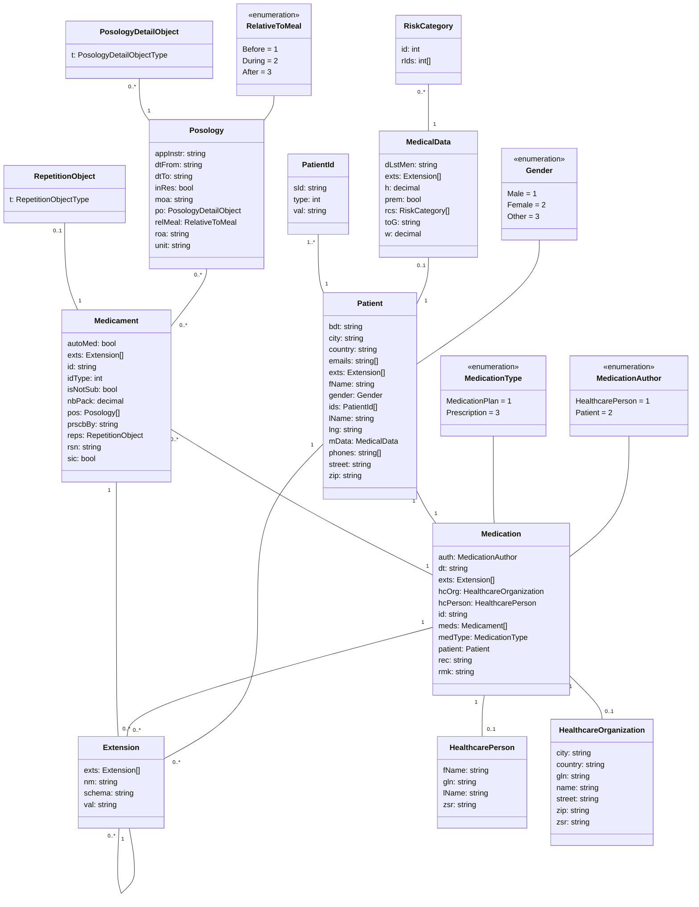
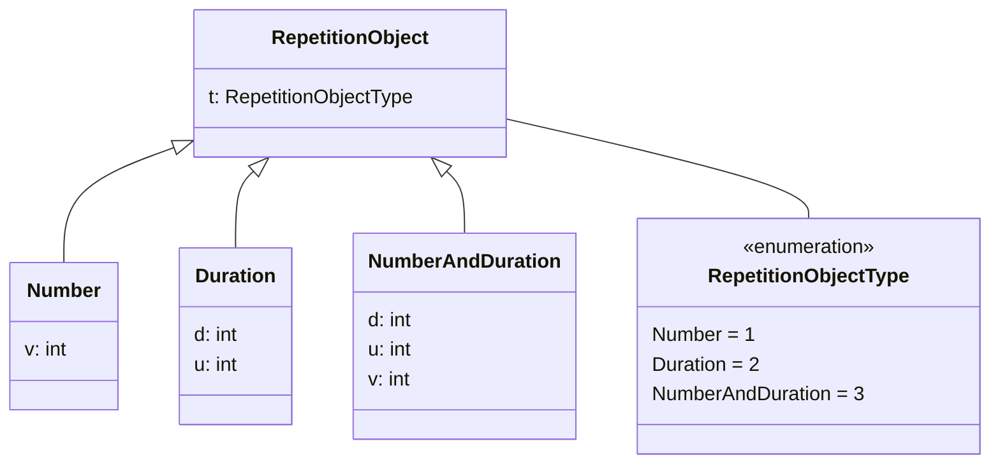

# eMedication Plan ChMed23A

**Contact**

Geschäftsstelle IG eMediplan<br>
c/o Köhler, Stüdeli & Partner GmbH<br>
Amthausgasse 18, 3011 Bern<br>
Tel. +41 (0)31 560 00 24<br>
info@emediplan.ch

## Table of contents

- [Table of contents](#table-of-contents)
- [Introduction](#introduction)
- [Conventions](#conventions)
    - [Objects](#objects)
    - [Naming](#naming)
    - [Value types](#value-types)
    - [Usage](#usage)
- [The ChMed23A eMedication object](#the-chmed23a-emedication-object)
    - [Overview of the object model](#overview-of-the-object-model)
    - [Object model](#object-model)
        - [Medication](#medication)
        - [Patient](#patient)
        - [PatientId](#patientid)
        - [MedicalData](#medicaldata)
        - [RiskCategory](#riskcategory)
        - [Medicament](#medicament)
        - [Posology (Pos)](#posology-pos)
        - [Repetition object](#repetition-object)
            - [Number](#number)
            - [Duration](#duration)
            - [NumberAndDuration](#numberandduration)
        - [Extension](#extension)
        - [HealthcarePerson](#healthcareperson)
        - [HealthcareOrganization](#healthcareorganization)
    - [Example of a JSON medication object](#example-of-a-json-medication-object)

## Introduction

Medication plans are a central pillar of any eHealth solution. To enable interoperability between eHealth systems in Switzerland, the organization "[IG eMediplan](https://emediplan.ch/)" was founded in 2016. Its aim is to support and provide public, open-source, medication plan formats used by a broad group of stakeholders from the public and private sectors.

This paper describes the specification and reference implementation of the object model for a medication plan, the so-called ChMed23A.

The reference consists of the content and layout specification for the electronic document, a JSON file containing a medication.

The content and layout specification for a paper-based layout used in Print/PDF scenarios is described in the document "eMediplan\_Paper-based\_Layout".

A ChMed23A can be transmitted using the so called ChTransmissionFormat[^1], which specifies the type of the content and includes the compressed and Base64 encoded content.

ChTransmissionFormat: <ins>input-type</ins>.`compressed-base64-payload`

Example:

<ins>ChMed23A</ins>.`H4sIAAAAAAAACq2OOw4CMQxE7zIt2ZUTAmzcLZsGiU+KUCEKYKlokIACRbk7jkLBAWisZz/NyAmb6/gAHxJWI7hsGgqhnsIOnBDBRmF4+9cebCuBtUL0Xy38g73MnIu+DxX/1nRUkCRiv1zLl9tzOF1uIloqxj9FGTKmId1oHcnxtGM7a+28c9YtJqSZCPkD+iD8fPQAAAA=`

This allows IT systems to store and transmit electronic medication plans in the form of a JSON file in UTF-8. It also enables the medication plan to be transmitted in a print-based form by using QR barcodes. Therefore, the medication plan is readable by users and systems alike. This is necessary to guarantee simple handling.

The possibility to transmit and store the compressed and Base64 encoded chunked payload (mainly to not exceed the maximum character size supported by a QR code), will be considered in the future.

Here is an example which describes how to create chunks that fit on one line in this document:

```
Chunk 1: ChMed23A.1/4.H4sIAAAAAAAACq2OOw4CMQxE7zIt2ZUTAmzcLZsGiU+KUCEKYKlokIACRbk7jk
Chunk 2: ChMed23A.2/4.LBAWisZz/NyAmb6/gAHxJWI7hsGgqhnsIOnBDBRmF4+9cebCuBtUL0Xy38g73MnI
Chunk 3: ChMed23A.3/4.u+DxX/1nRUkCRiv1zLl9tzOF1uIloqxj9FGTKmId1oHcnxtGM7a+28c9YtJqSZCPkD+
Chunk 4: ChMed23A.4/4.iD8fPQAAAA=
```

## Conventions

### Objects

In the context of this document, properties named 'Object' can hold different types of data. Every object contains a type as well as properties defined by the type itself.

E.g. for dosage objects, a simple dosage only contains an amount:

```json5
{
  "t": 1, // Simple dosage
  "a": 1 // Amount of 1
}
```

Whereas a dosage range specifies a minimum and a maximum amount:

```json5
{
  "t": 3, // Dosage range
  "aMin": 1.0, // Minimum amount of 1
  "aMax": 3.0 // Maximum amount of 3
}
```

Use the appropriate object type to represent the desired posology.

Objects must be deserialised according to the specified type.

### Naming

To minimise the size of the JSON files being generated, property names have been abbreviated using the following rules:

- Property names always start with a lowercase character.
- Properties holding an array of elements have the suffix 's', which represents the plural.
- Properties holding variable object types contain an 'o'. E.g. *PosologyDetail* object -> po, *Dosage* object -> do
- If the abbreviation of a word consists of a single character, keep it lowercase; use CamelCase otherwise. E.g. MeasurementType -> mt, ApplicationInstructions -> appInstr

### Value types

The following types are used for the properties in the model.

|**Property type**|**Format**|**Examples**|**Description**|
| :- | :- | :- | :- |
|boolean|true / false|<p>true</p><p>false</p>|The value is either true or false or can be null if not required.|
|integer|whole number|<p>1</p><p>700</p>|A number without a decimal separator. In case it contains a decimal separator, the number will be rounded to the closest whole number.|
|decimal|decimal number|<p>1\.5</p><p>7</p><p>30\.005</p>|A number which is either a whole number or a number containing a decimal, the separator is a dot.|
|string|text|"any text"|A text contained in quotes.|
|list of …|a list of items|<p>[1, 7]</p><p>["item1"]</p>|An array containing elements of the specified type.|
|object|complex object|{ }|Can contain any type of complex object. Supported type(s) will be described.|

### Usage

The usage specifies if a property must be provided. The following values can be set.

|**Usage**|**Description**|
| :- | :- |
|R|The value is required and must be set.|
|R if …|The value must be provided if the specified condition is met (usually if another property has a certain value).|
|O|The value is optional. It will be used by certain use cases if it has been set.|
|-|The value can be set, but won't be used.|
|x-N|A list of values can be provided; the minimum amount that must be included is specified by x.|

## The ChMed23A eMedication object

### Overview of the object model

The hierarchy of the object model is quite simple. A ChMed23A eMedication contains one patient with personal data and medical data and multiple medicaments with associated posologies.

The object model is represented using a [JSON](https://en.wikipedia.org/wiki/JSON) structure.

To allow serialisation and deserialisation in a QR barcode, the data size of the JSON file should be minimised. We therefore chose quite short property names. We recommend omitting required and optional fields when they are null or empty.

### Object model



Note that the two blocks _PosologyDetailObject_ and _RepetitionObject_ are dynamic objects, which
have not been fully represented in this diagram. Please refer to the dedicated chapters in this document for
additional details.

#### Medication

The *Medication* object is the main object; it contains exactly one *Patient* and a list of *Medicaments*.

<table>
<tr>
  <th rowspan="2"><b>Name</b></th>
  <th rowspan="2"><b>Type</b></th>
  <th colspan="2"><b>Usage</b></th>
  <th rowspan="2"><b>Description</b></th>
</tr>
<tr>
  <td>MP</td>
  <td>Rx</td>
</tr>
<tr>
  <td>patient</td>
  <td><i>Patient</i></td>
  <td>R</td>
  <td>R</td>
  <td>

  The patient

  Please refer to [Patient](#patient).

  </td>
</tr>
<tr>
  <td>hcPerson</td>
  <td><i>HealthcarePerson</i></td>
  <td>R if auth=1</td>
  <td>R if auth=1</td>
  <td>

  The healthcare person (the author of the document)

  Please refer to [HealthcarePerson](#healthcareperson).

  </td>
</tr>
<tr>
  <td>hcOrg</td>
  <td><i>HealthcareOrganization</i></td>
  <td>R if auth =1</td>
  <td>R if auth =1</td>
  <td>

  The healthcare organization in which the <i>HealthcarePerson</i> works.

  Please refer to [HealthcareOrganization](#healthcareorganization).

  </td>
</tr>
<tr>
  <td>meds</td>
  <td>list of <i>Medicaments</i></td>
  <td>0-N</td>
  <td>1-N</td>
  <td>

  List of medicaments
 
  Please refer to [Medicament](#medicament).

  </td>
</tr>
<tr>
  <td>exts</td>
  <td>list of <i>Extensions</i></td>
  <td>0-N</td>
  <td>0-N</td>
  <td>

  List of extensions

  Please refer to [Extension](#extension).

  </td>
</tr>
<tr>
  <td>medType</td>
  <td>integer</td>
  <td>R</td>
  <td>R if auth = HealhtcarePerson, - if auth = Patient</td>
  <td>

  The type of the _Medication_ object

  Possible values:

  1: MedicationPlan (MP)

  _2: PolymedicationCheck (PMC) **[deprecated]**_

  3: Prescription (Rx)

  </td>
</tr>
<tr>
  <td>id</td>
  <td>string</td>
  <td>O</td>
  <td>O</td>
  <td>The ID of the <i>Medication</i> object. The responsibility to set the ID is given to the ChMed23A creator.</td>
</tr>
<tr>
  <td>auth</td>
  <td>integer</td>
  <td>R</td>
  <td>R</td>
  <td>

  The author of the document

  Possible values:
 
  1: Healthcare person

  2: Patient (only for MedicationPlan, not for Prescription)

  </td>
</tr>
<tr>
  <td>rec</td>
  <td>string</td>
  <td>-</td>
  <td>O</td>
  <td>The recipient (GLN) of the electronic prescription. To be used if the electronic prescription is to be
    transmitted electronically to a healthcare professional.
  </td>
</tr>
<tr>
  <td>dt</td>
  <td>string</td>
  <td>R</td>
  <td>R</td>
  <td>

  The date of creation

  Format: yyyy-mm-ddThh:mm:ss+02:00
  ([ISO 8601](http://en.wikipedia.org/wiki/ISO_8601) Combined date and time in UTC)
  (e.g. 2016-06-16T16:26:15+02:00)
 
  </td>
</tr>
<tr>
  <td>rmk</td>
  <td>string</td>
  <td>O</td>
  <td>O</td>
  <td>The remark (any information/advice the author would like to share independently of a specific medicament)</td>
</tr>
</table>

#### Patient

The *Patient* object contains the patient's personal and health data.

<table>
<tr>
  <th rowspan="2"><b>Name</b></th>
  <th rowspan="2"><b>Type</b></th>
  <th colspan="2"><b>Usage</b></th>
  <th rowspan="2"><b>Description</b></th>
</tr>
<tr>
  <td>MP</td>
  <td>Rx</td>
</tr>
<tr>
  <td>fName</td>
  <td>string</td>
  <td>R</td>
  <td>R</td>
  <td>First name</td>
</tr>
<tr>
  <td>lName</td>
  <td>string</td>
  <td>R</td>
  <td>R</td>
  <td>Last name</td>
</tr>
<tr>
  <td>bdt</td>
  <td>string</td>
  <td>R</td>
  <td>R</td>
  <td>

  Date of birth, format: yyyy-mm-dd ([ISO 8601](http://en.wikipedia.org/wiki/ISO_8601) Date)

  </td>
</tr>
<tr>
  <td>gender</td>
  <td>integer</td>
  <td>R</td>
  <td>R</td>
  <td>

  Gender[^2] of the patient

  Possible values:

  1: Male

  2: Female

  3: Other

  </td>
</tr>
<tr>
  <td>street</td>
  <td>string</td>
  <td>O</td>
  <td>O</td>
  <td>Street</td>
</tr>
<tr>
  <td>zip</td>
  <td>string</td>
  <td>O</td>
  <td>O</td>
  <td>Postcode</td>
</tr>
<tr>
  <td>city</td>
  <td>string</td>
  <td>O</td>
  <td>O</td>
  <td>City</td>
</tr>
<tr>
  <td>country</td>
  <td>string</td>
  <td>O</td>
  <td>O</td>
  <td>

  Country
 
  If the address is in Switzerland, this property does not need to be set, as it is assumed by default that the address is in Switzerland.

  Format: Alpha-2 code ([ISO 3166](https://www.iso.org/iso-3166-country-codes.html) Country Codes)

  (e.g. FR for France)

  </td>
</tr>
<tr>
  <td>lng</td>
  <td>string</td>
  <td>R</td>
  <td>-</td>
  <td>

  The patient's language ([ISO 639-1](http://en.wikipedia.org/wiki/List_of_ISO_639-1_codes) language code) (e.g. de).
  Note that while the lowercase version is preferred, the codes are also valid in uppercase (e.g. DE).</p>

   </td>
</tr>
<tr>
  <td>ids</td>
  <td>list of <i>PatientId</i></td>
  <td>1-N</td>
  <td>1-N</td>
  <td>

  List of patient identifiers

  Please refer to [PatientId](#patientid).

  </td>
</tr>
<tr>
  <td>exts</td>
  <td>list of <i>Extensions</i></td>
  <td>0-N</td>
  <td>0-N</td>
  <td>

  List of extensions

  Please refer to [Extension](#extension).

  </td>
</tr>
<tr>
  <td>mData</td>
  <td><i>MedicalData</i></td>
  <td>O</td>
  <td>-</td>
  <td>

  Medical data information

  Please refer to [MedicalData](#medicaldata).

  </td>
</tr>
<tr>
  <td>phones</td>
  <td>list of string</td>
  <td>0-N</td>
  <td>0-N</td>
  <td>List of phone numbers</td>
</tr>
<tr>
  <td>emails</td>
  <td>list of string</td>
  <td>0-N</td>
  <td>0-N</td>
  <td>List of email addresses</td>
</tr>
</table>

#### PatientId

The *PatientId* object enables a patient to be uniquely identified.


<table>
<tr>
  <th rowspan="2"><b>Name</b></th>
  <th rowspan="2"><b>Type</b></th>
  <th colspan="2"><b>Usage</b></th>
  <th rowspan="2"><b>Description</b></th>
</tr>
<tr>
  <td>MP</td>
  <td>Rx</td>
</tr>
<tr>
  <td>type</td>
  <td>integer</td>
  <td>R</td>
  <td>R</td>
  <td>

  The type of ID

  Possible values:

  1: Insurance card number

  2: Local PID

  </td>
</tr>
<tr>
  <td>sId</td>
  <td>string</td>
  <td>

  \- for `type == 1`

  R for `type == 2`

  </td>
  <td>

  \- for `type == 1`

  R for `type == 2`

  </td>
  <td>

  The system (e.g. OID, URL etc.) enabling the _Patient_ to be identified (system identifier).

  To be used only with `type` 2 (Local PID)

  </td>
</tr>
<tr>
  <td>val</td>
  <td>string</td>
  <td>R</td>
  <td>R</td>
  <td>The value of the ID</td>
</tr>
</table>

#### MedicalData

Applies only to medType MedicationPlan (MP).

The MedicalData object contains the patient's health data.

<table>
<tr>
  <th rowspan="2"><b>Name</b></th>
  <th rowspan="2"><b>Type</b></th>
  <th><b>Usage</b></th>
  <th rowspan="2"><b>Description</b></th>
</tr>
<tr>
  <td>MP</td>
</tr>
<tr>
  <td>dLstMen</td>
  <td>string</td>
  <td>O</td>
  <td>

  Only required in case of <i>Risk Id</i> 78 in <i>RiskCategory</i> 3

  First day of last menstruation, format: yyyy-mm-dd ([ISO 8601](http://en.wikipedia.org/wiki/ISO_8601) Date)

  </td>
</tr>
<tr>
  <td>prem</td>
  <td>boolean</td>
  <td>O</td>
  <td>

  True if it is a premature baby, false otherwise (only if age <= 18 months)

  </td>
</tr>
<tr>
  <td>toG</td>
  <td>string</td>
  <td>O</td>
  <td>

  The time of gestation, should usually only be filled if premature is set to true.

  Format: `{week}-{day}`

  `week` is a natural number including 0, `day` excluding 0

  </td>
</tr>
<tr>
  <td>rcs</td>
  <td>list of <i>RiskCategory</i></td>
  <td>0-N</td>
  <td>

  Risk categories

  Please refer to [RiskCategory](#riskcategory).

  </td>
</tr>
<tr>
  <td>w</td>
  <td>decimal</td>
  <td>O</td>
  <td>Weight (kilogram)</td>
</tr>
<tr>
  <td>h</td>
  <td>decimal</td>
  <td>O</td>
  <td>Height (centimetre)</td>
</tr>
<tr>
  <td>exts</td>
  <td>list of <i>Extensions</i></td>
  <td>0-N</td>
  <td>

  List of extensions

  Please refer to [Extension](#extension).

  </td>
</tr>
</table>

#### RiskCategory

The RiskCategory object contains risks grouped by category.

<table>
<tr>
  <th rowspan="2"><b>Name</b></th>
  <th rowspan="2"><b>Type</b></th>
  <th><b>Usage</b></th>
  <th rowspan="2"><b>Description</b></th>
</tr>
<tr>
  <td>MP</td>
</tr>
<tr>
  <td>id</td>
  <td>integer</td>
  <td>R</td>
  <td>

  The ID of the risk category (_RC Id_)

  Possible values:

  1: Renal insufficiency

  2: Liver insufficiency

  3: Reproduction

  4: Competitive athlete

  5: Operating vehicles/machines

  6: Allergies

  7: Diabetes

  </td>
</tr>
<tr>
  <td>rIds</td>
  <td>list of integer</td>
  <td>0-N</td>
  <td>List of risks (<i>Risk Id</i>) within the risk category (<i>RC Id</i>)</td>
</tr>
</table>

If the risk category is specified without any risk being specified in the list of risks, the entire risk category is considered as explicitly excluded for the current patient. If the category does not exist, the risks are considered as unknown for the patient.

The possible risks are listed below. The allergies have not been listed here. You can find them on the website of the [eMediplan FHIR Implementation Guide](https://build.fhir.org/ig/ahdis/chmed/branches/master/CodeSystem-chmed-codesystem-risks-cdscode.html).


|**RC Id**|**Risk Id**|**German**|**French**|
| - | - | - | - |
|1|597|Niereninsuffizienz, terminale (Clcr <15 ml/min)|Insuffisance rénale, terminale (Clcr <15 ml/min)|
|1|575|Niereninsuffizienz, schwere (Clcr ≥15–29 ml/min)|Insuffisance rénale, sévère (Clcr ≥15–29 ml/min)|
|1|576|Niereninsuffizienz, mittelschwere (Clcr ≥30–59 ml/min)|Insuffisance rénale, modérée (Clcr ≥30–59 ml/min)|
|1|577|Niereninsuffizienz, leichte (Clcr ≥60–89 ml/min)|Insuffisance rénale, légère (Clcr ≥60–89 ml/min)|
|2|572|Leberinsuffizienz, schwere (Child-Pugh C)|Insuffisance hépatique, sévère (Child-Pugh C)|
|2|573|Leberinsuffizienz, mittelschwere (Child-Pugh B)|Insuffisance hépatique, modérée (Child-Pugh B)|
|2|574|Leberinsuffizienz, leichte (Child-Pugh A)|Insuffisance hépatique, légère (Child-Pugh A)|
|3|78|Schwangerschaft|Grossesse|
|3|77|Stillzeit|Allaitement|
|3|612|Frauen im gebärfähigen Alter|Femmes en âge de procréer|
|4|580|Leistungssportler|Sportifs de compétition|
|5|615|Potenziell gefährlichen Situationen ausgesetzt, wie beispielsweise dem Führen von Fahrzeugen, dem Bedienen von Maschinen oder dem Arbeiten in grossen Höhen|Exposés à des situations potentiellement dangereuses, comme la conduite de véhicules, machines ou travaillant en haute altitude|
|6|The allergies have not been listed here. The full list can be found in the [eMediplan FHIR Implementation Guide](https://build.fhir.org/ig/ahdis/chmed/branches/master/CodeSystem-chmed-codesystem-risks-cdscode.html)|||
|7|779|Diabetes mellitus Typ 1|Diabète de type 1|
|7|780|Diabetes mellitus Typ 2|Diabète de type 2|

#### Medicament

The *Medicament* object contains information about a medicament as well as its posologies.

<table>
<tr>
  <th rowspan="2"><b>Name</b></th>
  <th rowspan="2"><b>Type</b></th>
  <th colspan="2"><b>Usage</b></th>
  <th rowspan="2"><b>Description</b></th>
</tr>
<tr>
  <td>MP</td>
  <td>Rx</td>
</tr>
<tr>
  <td>id</td>
  <td>string</td>
  <td>R</td>
  <td>R</td>
  <td>The ID defined in the <i>IdType</i> below. If the <i>IdType</i> is 'None', add a free text description here.
  </td>
</tr>
<tr>
  <td>idType</td>
  <td>integer</td>
  <td>R</td>
  <td>R</td>
  <td>

  The type of _ID_

  Possible values:

  1: None

  2: GTIN[^3]

  3: Pharmacode[^4]

  4: Product Number[^5] (not for Rx)

  </td>
</tr>
<tr>
  <td>pos</td>
  <td>list of <i>Posology</i></td>
  <td>0-N</td>
  <td>0-N</td>
  <td>

  List of posologies

  Please refer to [Posology](#posology-pos).

  </td>
</tr>
<tr>
  <td>rsn</td>
  <td>string</td>
  <td>O</td>
  <td>O</td>
  <td>Reason for applying the medication (the reason for the medication treatment)</td>
</tr>
<tr>
  <td>autoMed</td>
  <td>boolean</td>
  <td>R</td>
  <td>-</td>
  <td><p>Automedication (self-medication), true if it is automedication, false otherwise.</p>
    <p>Self-medication = The patient self-administers treatment without a prescription from a physician.</p></td>
</tr>
<tr>
  <td>prscbBy</td>
  <td>string</td>
  <td>O</td>
  <td>-</td>
  <td>Prescribed by: the GLN or designation of the person who prescribed the medicament (e.g. physician, pharmacist
    etc.)
  </td>
</tr>
<tr>
  <td>reps</td>
  <td><i>Repetition</i> object</td>
  <td>-</td>
  <td>O</td>
  <td>

  The repetition object indicates how often a prescription can be repeated or how long the prescription is valid.

  If no repetition object is set, it will be interpreted as if the _Repetition_ object of the type _Number_ had been set with V=1.

  If the prescription of a medicament is not repeatable, use the _Repetition_ object with the type _Number_ and set V=0.

  Please refer to [Repetition object](#repetition-object).

  </td>
</tr>
<tr>
  <td>isNotSub</td>
  <td>boolean</td>
  <td>O</td>
  <td>O</td>
  <td>True if the medicament should not be substituted, false otherwise. Default: false</td>
</tr>
<tr>
  <td>sic</td>
  <td>boolean</td>
  <td>-</td>
  <td>O</td>
  <td>Sic erat scriptum (latin). Is intended to avoid misunderstandings between the physician and pharmacist and
    indicates to the pharmacist that the physician has deliberately chosen the prescription and wishes to prescribe
    the drug in exactly this way and not otherwise. Default: false
  </td>
</tr>
<tr>
  <td>nbPack</td>
  <td>decimal</td>
  <td>-</td>
  <td>O</td>
  <td>Number of packages to be delivered. Default: 1</td>
</tr>
<tr>
  <td>exts</td>
  <td>list of <i>Extensions</i></td>
  <td>0-N</td>
  <td>0-N</td>
  <td>

  List of extensions

  Please refer to [Extension](#extension).

  </td>
</tr>
</table>

#### Posology (Pos)

A posology describes when and what amount of a medicament must be taken.

The table below describes the properties of a posology. Please refer to the document "eMediplan\_ChMed23A\_Posology" for additional information about creating posologies.

<table>
<tr>
  <th rowspan="2"><b>Name</b></th>
  <th rowspan="2"><b>Type</b></th>
  <th colspan="2"><b>Usage</b></th>
  <th rowspan="2"><b>Description</b></th>
</tr>
<tr>
  <td>MP</td>
  <td>Rx</td>
</tr>
<tr>
  <td>dtFrom</td>
  <td>string</td>
  <td>O</td>
  <td>O</td>
  <td>

  From date (start date of medication treatment),

  format: YYYY-MM-DDThh:mm:ss+02:00 or YYYY-MM-DD
  ([ISO 8601](http://en.wikipedia.org/wiki/ISO_8601) Combined date and time including time zone or date only)
  (e.g. 2016-06-16T16:26:15+02:00)

  </td>
</tr>
<tr>
  <td>dtTo</td>
  <td>string</td>
  <td>O</td>
  <td>O</td>
  <td>
  To date (end date of medication treatment),

  format: YYYY-MM-DDThh:mm:ss+02:00 or YYYY-MM-DD
  ([ISO 8601](http://en.wikipedia.org/wiki/ISO_8601) Combined date and time including time zone or date only)
  (e.g. 2016-06-16T16:26:15+02:00)

  The _DtTo_ must be considered as inclusive. For example, DtTo: 2015-05-01, the patient must apply the medicament also on 2015-05-01.

  </td>
</tr>
<tr>
  <td>inRes</td>
  <td>boolean</td>
  <td>O</td>
  <td>O</td>
  <td><p>Reserve medication</p>
    <p>True if in reserve; false otherwise. Default: false</p></td>
</tr>
<tr>
  <td>po</td>
  <td><i>PosologyDetail</i> object</td>
  <td>R</td>
  <td>R</td>
  <td><p>The <i>PosologyDetail</i> object contains the details of the posology.</p>
    <p>Please refer to the document "eMediplan_ChMed23A_Posology" for additional information.</p></td>
</tr>
<tr>
  <td>relMeal</td>
  <td>integer</td>
  <td>O</td>
  <td>O</td>
  <td><p>Indicates whether a medicament must be taken relative to a meal.</p>
    <p>Possible values:</p>
    <p>1: Before</p>
    <p>2: During</p>
    <p>3: After</p></td>
</tr>
<tr>
  <td>unit</td>
  <td>string</td>
  <td>R</td>
  <td>O</td>
  <td>

  The quantity unit.

  Allowed values (code representation, display values are not allowed):

  See [eMediplan FHIR Implementation Guide](https://build.fhir.org/ig/ahdis/chmed/branches/master/CodeSystem-chmed-codesystem-cdtyp9.html)

  </td>
</tr>
<tr>
  <td>appInstr</td>
  <td>string</td>
  <td>O</td>
  <td>O</td>
  <td><p>Application instructions (further information on how to apply the medication, e.g. dissolve in a glass of
    water or fruit juice).</p>
    <p>Please note: For unstructured posology we recommend using the <i>Posology</i> object <i>FreeText</i> instead of
      <i>AppInstr</i>. </p>
    <p>Please refer to the document "eMediplan_ChMed23A_Posology".</p></td>
</tr>
<tr>
  <td>roa</td>
  <td>string</td>
  <td>O</td>
  <td>O</td>
  <td>

  The route of administration (according to EDQM[^6])

  Allowed values (code representation, display values are not allowed):

  See [eMediplan FHIR Implementation Guide](http://chmed.emediplan.ch/fhir/CodeSystem-chmed-codesystem-cdtyp61.html)

  </td>
</tr>
<tr>
  <td>moa</td>
  <td>string</td>
  <td>O</td>
  <td>O</td>
  <td>

  The method of administration (according to EDQM[^6])

  Allowed values (code representation, display values are not allowed):

  See [eMediplan FHIR Implementation Guide](http://chmed.emediplan.ch/fhir/CodeSystem-chmed-codesystem-cdtyp61.html)

  </td>
</tr>
</table>

#### Repetition object

Applies only to *medType* Prescription (Rx).

The repetition object indicates how often a prescription can be repeated or how long the prescription is valid.

The following table shows all *Repetition* objects with their *Repetition* object type:

|**Repetition object**|**Repetition object type**|
| :- | :- |
|Number|1|
|Duration|2|
|NumberAndDuration|3|



##### Number


<table>
<tr>
  <th rowspan="2"><b>Name</b></th>
  <th rowspan="2"><b>Type</b></th>
  <th><b>Usage</b></th>
  <th rowspan="2"><b>Description</b></th>
</tr>
<tr>
  <td>Rx</td>
</tr>
<tr>
  <td>v</td>
  <td>integer</td>
  <td>R</td>
  <td><p>The value defining the number of repetitions; how often a prescribed medicament can be redeemed after it has
    been redeemed once.</p>
    <p>If the prescription of a medicament is not repeatable set 0.</p>
    <p>Validation: Must be greater than or equal 0.</p></td>
</tr>
</table>

##### Duration


<table>
<tr>
  <th rowspan="2"><b>Name</b></th>
  <th rowspan="2"><b>Type</b></th>
  <th><b>Usage</b></th>
  <th rowspan="2"><b>Description</b></th>
</tr>
<tr>
  <td>Rx</td>
</tr>
<tr>
  <td>d</td>
  <td>integer</td>
  <td>R</td>
  <td><p>The duration of the prescription defining in which time frame the prescription can be redeemed (permanent
    prescription).</p>
    <p>E.g. the prescription is repeatable within 6 months.</p>
    <p>Validation: Must be greater than 0.</p></td>
</tr>
<tr>
  <td>u</td>
  <td>integer</td>
  <td>R</td>
  <td><p>The unit of the Duration (<i>d</i>)</p>
    <p>Possible values:</p>
    <p>1: Second</p>
    <p>2: Minute</p>
    <p>3: Hour</p>
    <p>4: Day</p>
    <p>5: Week</p>
    <p>6: Month</p>
    <p>7: Year</p></td>
</tr>
</table>

##### NumberAndDuration


<table>
<tr>
  <th rowspan="2"><b>Name</b></th>
  <th rowspan="2"><b>Type</b></th>
  <th><b>Usage</b></th>
  <th rowspan="2"><b>Description</b></th>
</tr>
<tr>
  <td>Rx</td>
</tr>
<tr>
  <td>v</td>
  <td>integer</td>
  <td>R</td>
  <td><p>The value defining the number of repetitions; how often a prescribed medicament can be redeemed within the
    defined duration (<i>d</i>) after it has been redeemed once.</p>
    <p>Validation: Must be greater than or equal 0.</p></td>
</tr>
<tr>
  <td>d</td>
  <td>Integer</td>
  <td>R</td>
  <td><p>The duration of the prescription defining in which time frame the prescription can be redeemed (permanent
    prescription).</p>
    <p>E.g. the prescription is repeatable within 6 months.</p>
    <p>Validation: Must be greater than 0.</p></td>
</tr>
<tr>
  <td>u</td>
  <td>integer</td>
  <td>R</td>
  <td><p>The unit of the duration (<i>d</i>)</p>
    <p>Possible values:</p>
    <p>1: Second</p>
    <p>2: Minute</p>
    <p>3: Hour</p>
    <p>4: Day</p>
    <p>5: Week</p>
    <p>6: Month</p>
    <p>7: Year</p></td>
</tr>
</table>

#### Extension

Extensions can be used to include additional information.

<table>
<tr>
  <th rowspan="2"><b>Name</b></th>
  <th rowspan="2"><b>Type</b></th>
  <th colspan="2"><b>Usage</b></th>
  <th rowspan="2"><b>Description</b></th>
</tr>
<tr>
  <td>MP</td>
  <td>Rx</td>
</tr>
<tr>
  <td>nm</td>
  <td>string</td>
  <td>R</td>
  <td>R</td>
  <td>The name of the field</td>
</tr>
<tr>
  <td>val</td>
  <td>string</td>
  <td>O</td>
  <td>O</td>
  <td>The value of the field</td>
</tr>
<tr>
  <td>schema</td>
  <td>string</td>
  <td>R</td>
  <td>R</td>
  <td>The schema can be any string and can be used to determine how to interpret the extension.</td>
</tr>
<tr>
  <td>exts</td>
  <td>list of <i>Extensions</i></td>
  <td>0-N</td>
  <td>0-N</td>
  <td>The list of nested extensions</td>
</tr>
</table>

#### HealthcarePerson

The *HealthcarePerson* object contains the healthcare person's data.

<table>
<tr>
  <th rowspan="2"><b>Name</b></th>
  <th rowspan="2"><b>Type</b></th>
  <th colspan="2"><b>Usage</b></th>
  <th rowspan="2"><b>Description</b></th>
</tr>
<tr>
  <td>MP</td>
  <td>Rx</td>
</tr>
<tr>
  <td>gln</td>
  <td>string</td>
  <td>O</td>
  <td>R</td>
  <td>The GLN</td>
</tr>
<tr>
  <td>fName</td>
  <td>string</td>
  <td>R</td>
  <td>R</td>
  <td>First name</td>
</tr>
<tr>
  <td>lName</td>
  <td>string</td>
  <td>R</td>
  <td>R</td>
  <td>Last name</td>
</tr>
<tr>
  <td>zsr</td>
  <td>string</td>
  <td>-</td>
  <td>O</td>
  <td><p>ZSR number</p>
    <p>The ZSR number may only be set once, either in object <i>HealthcarePerson</i> or in object <i>HealthcareOrganization</i>.
    </p></td>
</tr>
</table>

#### HealthcareOrganization

The *HealthcareOrganization* object contains the healthcare organization's data.

<table>
<tr>
  <th rowspan="2"><b>Name</b></th>
  <th rowspan="2"><b>Type</b></th>
  <th colspan="2"><b>Usage</b></th>
  <th rowspan="2"><b>Description</b></th>
</tr>
<tr>
  <td>MP</td>
  <td>Rx</td>
</tr>
<tr>
  <td>gln</td>
  <td>string</td>
  <td>R/O*</td>
  <td>-</td>
  <td><p>The GLN</p>
    <p>* R if no GLN is set in object HealthcarePerson, otherwise O</p></td>
</tr>
<tr>
  <td>name</td>
  <td>string</td>
  <td>R</td>
  <td>R</td>
  <td>Name</td>
</tr>
<tr>
  <td>street</td>
  <td>string</td>
  <td>R</td>
  <td>R</td>
  <td>Street</td>
</tr>
<tr>
  <td>zip</td>
  <td>string</td>
  <td>R</td>
  <td>R</td>
  <td>Postcode</td>
</tr>
<tr>
  <td>city</td>
  <td>string</td>
  <td>R</td>
  <td>R</td>
  <td>City</td>
</tr>
<tr>
  <td>country</td>
  <td>string</td>
  <td>O</td>
  <td>O</td>
  <td>

  Country
 
  If the address is in Switzerland, this property does not need to be set, as it is assumed by default that the address is in Switzerland.

  Format: Alpha-2 code ([ISO 3166](https://www.iso.org/iso-3166-country-codes.html) Country Codes)

  (e.g. FR for France)

  </td>
</tr>
<tr>
  <td>zsr</td>
  <td>string</td>
  <td>-</td>
  <td>O</td>
  <td><p>ZSR number</p>
    <p>The ZSR number may only be set once, either in object <i>HealthcarePerson</i> or in object <i>HealthcareOrganization</i>.
    </p></td>
</tr>
</table>

### Example of a JSON medication object

A typical, valid ChMed23A object would look like this. This example describes that Dora Graber must take 1 pill of Med1 every day at 08:00.

```json5
{
  "patient": {
    "fName": "Dora",
    "lName": "Graber",
    "bdt": "1951-11-06",
    "gender": 2 // Female
  },
  "meds": [
    {
      "id": "Med1",
      "idType": 1, // None
      "pos": [
        {
          "po": {
            "t": 4, // Cyclic
            "cyDuU": 4, // Daily
            "cyDu": 1, // Repeate every 1 (day)
            "tdo": {
              "t": 2, // Timed dosage
              "ts": [
                {
                  "dt": "08:00:00", // Take every day at 08:00
                  "do": {
                    "t": 1, // Simple dosage
                    "a": 1 // Amount of 1 (tablet)
                  }
                }
              ]
            },
            "tdpc": 1
          }
        }
      ],
      "unit": "TABL",
      "nbPack": 1.0
    }
  ],
  "medType": 1,
  "id": "9196a4e4-3439-4714-b89a-89402db30c02",
  "auth": 2, // Patient is author
  "dt": "2023-07-14T12:40:57.1203496+02:00"
}
```

[^1]: ChTransmissionFormat: Transmission format (currently used with ChMed and ChVac)
[^2]: The terms "gender" and "sex" are considered synonyms in ChMed23A.
[^3]: Global Trade Item Number (GTIN): https://www.refdata.ch/de/artikel/anmeldung/artikel-refdatabase-gtin
[^4]: The Pharmacode is the main article identifier in the INDEX database. It is managed by the editorial team at HCI Solutions AG.
[^5]: The product number is a unique identifier for products in the INDEX database. It is managed by the editorial team at HCI Solutions AG.
[^6]: EDQM: European Directorate for the Quality of Medicines & HealthCare
