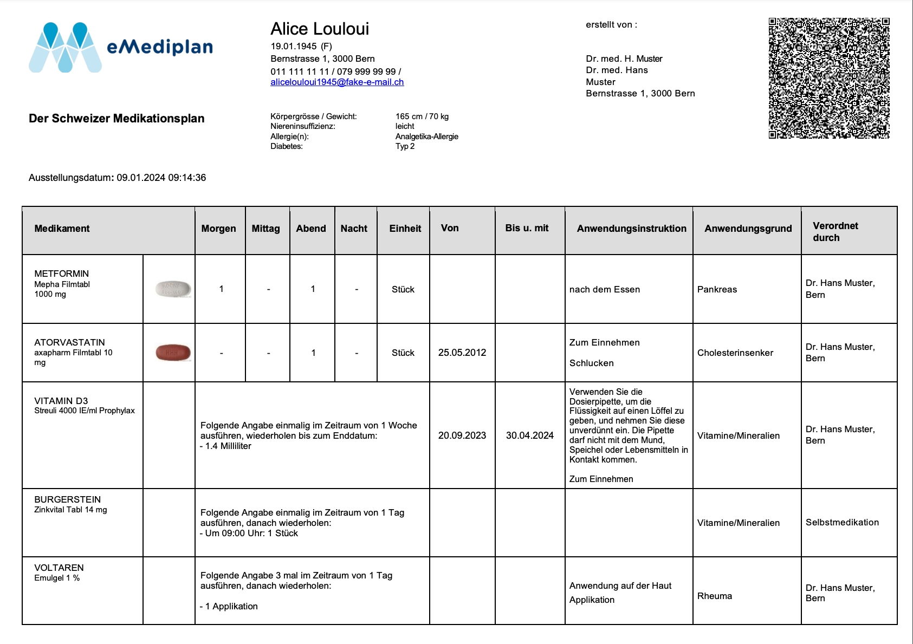
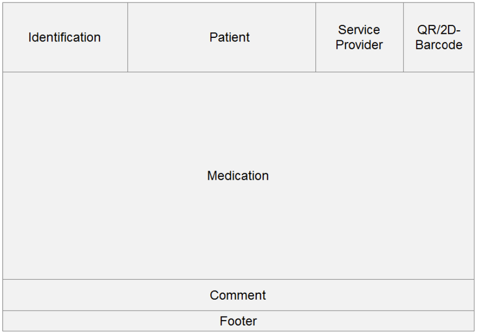

# eMedication Plan CHMED23A Paper-based Layout

**Contact**

Geschäftsstelle IG eMediplan<br>
c/o Köhler, Stüdeli & Partner GmbH<br>
Amthausgasse 18, 3011 Bern<br>
Tel. +41 (0)31 560 00 24<br>
info@emediplan.ch

## Table of contents

- [Table of contents](#table-of-contents)
- [Introduction](#introduction)
- [Header/Identification](#headeridentification)
- [Header/Patient](#headerpatient)
- [Header/Healthcare Provider](#headerhealthcare-provider)
- [Header/2D barcode](#header2d-barcode)
- [Medication](#medication)
- [Comment](#comment)
- [Footer](#footer)
- [Posology details in text form](#posology-details-in-text-form)

## Introduction

This document is an addition to the main specification of [CHMED23A](./README.md).
While the main specification focuses on the machine-readable part, this document provides guidelines for creating paper-based medication plans on the basis of the data defined by the main specificaton.
From the perspective of the users involved, such as doctors, pharmacists and patients, this document must always "look and feel" the same, no matter on what IT system the printout was generated.
This chapter shows the requirements in terms of content and layout. In addition, the inclusion of the CHMED object as part of a 2D barcode on the form allows a technical data transfer using a paper-based format.
This is a simple but practical solution that allows for user consent and data persistence using only the printed document.

> [!IMPORTANT]
> To ensure compatibility with the electronic patient record,
> implementers MUST generate PDF documents which conform to the PDF/A specification (https://en.wikipedia.org/wiki/PDF/A).

The paper-based version of the medication plan has the following elements, arranged on an A4 paper in landscape format:

- A header section using the top 30 % of the page
    - The left-hand 25 % contains the logo of "IG eMediplan" (or the user's software) and the subtitle ("Medikationsplan" or "Plan de médication" depending on the language used)
    - The middle 50 % contains patient identification data: name, address, date of birth, reproductive state, height/weight, insufficiencies, allergies
    - The right-hand 25 % contains a 2D barcode of the complete encapsulated compressed CHMED object
- A body section using the remaining 70 % of the page and the full 100 % of subsequent pages
    - The date of the document generation or printout
    - A table of the complete medication
        - The name of the medication and its main substance/s
        - Optionally: an identa image of the medication/pill
        - The medication plan details according to the CHMED object, as described below

As a measure to boost interoperability and as the only "business rule", eMediplan reading and printing functionalities must be provided by IT systems at no additional cost.

### Example

The following example is based on the data of [example 1](https://github.com/ig-emediplan/specification/blob/main/chmed23a/examples.md#example-1):



## Overview

To be more precise, a printout of an eMediplan has the following layout blocks:

Header (full width section at the top of the document, minimum height of 4 cm, no border lines)

- Identification (far left)
- Patient (middle)
- Service provider (right)
- 2D barcode (far right)

Medication (full width section)

Comment (optional, full width section below the medication block)

Footer (full width section at the end of the document)



### Printing rules

Single-sided printing only, margin of 0.8 cm on all sides.

## Header/Identification

The identification block is located at the top left of the eMediplan and has a width of approximately 7 cm. The height depends on the patient block and the service provider block. It consists of the "eMediplan" logo and the identification name "The Swiss medication plan" (text according to the patient's language).

### Logo

The logo can be found on the "IG eMediplan" website under *Downloads*: [https://emediplan.ch/downloads/](https://emediplan.ch/downloads/).

|**Name**  |**Description** |**Characteristics** |
| - | - | - |
|**Logo** |eMediplan |300dpi / jpg / 1.63 cm x 5.95 cm |

### Identification


|**Name**  |**Description** |**Characteristics**  |
| - | - | - |
|**Der Schweizer Medikationsplan** |Label of the document |Arial 11 pt bold |


## Header/Patient

The patient block contains the patient information, which is divided into personal data and medical and risk parameters.

The block is located to the right of the identification block and has a width of approximately 10 cm. The height of this block depends on the length of the information contained in the personal data and the medical and risk parameters. If the content exceeds the provided width, then a word wrap is allowed, which in turn provokes shifting the medication table.

### Personal data

The personal data consists of the patient's first name and last name.
Below the first name and last name, the patient's birth date and gender are shown, with the gender abbreviated and in parentheses.
Below the birth date and gender, the address is shown.
The individual parts of the address (street, zip, city) are separated from each other by blank spaces and commas.
If the country is not Switzerland, it is displayed with the [ISO 3166](https://www.iso.org/iso-3166-country-codes.html) Country code after the city and in parentheses.

On a new line, all phone numbers and email addresses are shown separated by slashes `/`.
If it exceeds the width, the line is broken but never within a single email address or phone number.

|**Name**  |**Description** |**Characteristics** |**CHMED23A** |**Field** |
| - | - | - | - | - |
|**First name** |Patient's first name |Arial 16 pt bold |[Patient](./README.md#patient)|fName |
|**Last name** |Patient's last name |Arial 16 pt bold |[Patient](./README.md#patient)|lName |
|**Birth date** |Patient's date of birth  |<p>Format: DD.MM.YYYY</p><p>**Printed as:** </p><p>Born on:  </p>|[Patient](./README.md#patient)| bdt |
|**Gender** |<p>Patient's gender</p><p>**Possibilities:** </p><p>- F = female </p><p>- M = male </p><p>- O = other </p>|The gender is shown in parentheses () after the birth date. |[Patient](./README.md#patient)|Gender |
|**Street** |Street name and house number of the patient's address |Arial 8 pt |[Patient](./README.md#patient)|street |
|**Zip** |Zip of the city of the patient's address |Arial 8 pt |[Patient](./README.md#patient)|zip |
|**City** |Name of the city of the patient's address |Arial 8 pt |[Patient](./README.md#patient)|city |
|**Country** | TODO | Arial 8 pt |[Patient](./README.md#patient)| country |
|**Phones** |Patient's phone numbers |<p>Arial 8 pt </p><p>Format: +41 58 123 45 67 </p><p>no line breaks are allowed within a single phone number</p>|[Patient](./README.md#patient)| phones |
|**Emails** |Patient's email addresses | Arial 8 pt<br>no line breaks are allowed within a single email address |[Patient](./README.md#patient)| emails |

### Medical and risk parameters

The individual medical and risk parameters allocated to the patient may contain the following parameters: time of gestation,  reproduction,  height,  weight,  renal  insufficiency,  liver  insufficiency,  diabetes,  competitive  athlete, operating  vehicles/machines  and  allergies.  To  enhance  the  optical  distinction  between  medical  and  risk parameters  and  personal  data  a  separation  of  the  two  by  blank  space  is  recommended.  Arial  8.5  pt  is recommended as the font and font size.

The medical and risk parameters have to be shown one below the other in the following way:

|**Name**  |**Description** |**Characteristics** |**CHMED23A** |**Field** |
| - | - | - | - | - |
|**Premature infant** |Information as to whether the baby is premature |<p>**Printed as:**</p><p>Premature infant:</p>|[MedicalData](./README.md#medicaldata)|prem |
|**Gestation (week / day)** |Week and day of childbirth |<p>**Printed as:** </p><p>Gestation (week / day): </p>|[MedicalData](./README.md#medicaldata)|toG |
|**Reproduction** |<p>Information as to whether the patient is currently pregnant or nursing. In case of pregnancy, the date of the last period is shown. </p><p>**Possibilities:** </p><p>- Childbearing age </p><p>- Lactation </p><p>- Pregnant (first day of last menstruation) </p>|<p>**Printed as:**</p><p>Reproduction:</p>|[RiskCategory](./README.md#riskcategory)| id |
|**Height**  |Patient's height in cm |<p>**Printed as:**</p><p>Height / Weight:</p>|[MedicalData](./README.md#medicaldata)| h |
|**Weight** |Patient's weight in kg |<p>**Printed as:**</p><p>Height / Weight:</p>|[MedicalData](./README.md#medicaldata)| w |
|**Renal insufficiency** |<p>Information as to whether the patient suffers from renal insufficiency and if so, at what stage. </p><p>**Possibilities:** </p><p>- light (Clcr 60 – 90 ml/min) </p><p>- moderate (Clcr 30 – 60 ml/min) </p><p>- severe (Clcr 15 – 30 ml/min) </p><p>- terminal (Clcr <15 ml/min) </p>|<p>**Printed as:** </p><p>Renal insufficiency: </p>|[RiskCategory](./README.md#riskcategory)| id |
|**Liver insufficiency** |<p>Information as to whether the patient suffers from liver insufficiency and if so, at what stage. </p><p>**Possibilities:** </p><p>- mild Child-Pugh A </p><p>- moderate Child-Pugh B  </p><p>- severe Child-Pugh C </p>|<p>**Printed as:** </p><p>Liver insufficiency: </p>|[RiskCategory](./README.md#riskcategory)| id |
|**Diabetes** |<p>Information as to whether the patient suffers from diabetes and if so, what type of diabetes. </p><p>**Possibilities:** </p><p>- Diabetes mellitus type 1 </p><p>- Diabetes mellitus type 2 </p>|<p>**Printed as:**</p><p>Diabetes:</p>|[RiskCategory](./README.md#riskcategory)| id |
|**Competitive athlete** |Information as to whether the patient is a competitive athlete. |<p>**Printed as:**</p><p>Competitive athlete:</p>|[RiskCategory](./README.md#riskcategory)| id |
|**Operating vehicles/machines** |Information as to whether the patient operates vehicles and machines. |<p>**Printed as:** </p><p>Operating vehicles/machines: </p>|[RiskCategory](./README.md#riskcategory)| id |
|**Allergy** |Information as to whether the patient suffers from allergies and if so, which ones. |<p>**Printed as:**</p><p>Allergy(ies):</p>|[RiskCategory](./README.md#riskcategory)| id |

## Header/Healthcare Provider

The healthcare provider block is located next to the patient block (to the right) and has a minimum height of 4 cm and a width of approximately 6.5 cm. The height depends on the patient block. This block represents the author of the eMediplan. It is possible to display the author's organisation logo.

### Logo service or healthcare provider

|**Name**  |**Description** |**Characteristics** |**CHMED23A** |**Field** |
| - | - | - | - | - |
|**Logo** |Logo of the service or healthcare provider |300dpi.jpg<br>Height 0.26 cm<br>Width 2.36 cm<br>**Printed as:**<br>Created by: |||

### Healthcare provider

First name and last name should be on the same line.
Similarly, zipp and city should be on the same line.
All other parts are separated by line breaks.

|**Name**  |**Description** |**Characteristics** |**CHMED23A** |**Field** |
| - | - | - | - | - |
| **First name** | Healthcare person's first name | Arial 8.5 pt | [HealthcarePerson](./README.md#healthcareperson) | fName |
| **Last name** | Healthcare person's last name | Arial 8.5 pt | [HealthcarePerson](./README.md#healthcareperson) | lName |
| **Organization name** | Healthcare organization's name | Arial 8.5 pt | [HealthcareOrganization](./README.md#healthcareorganization) | name |
| **Organization street** | Healthcare organization's street | Arial 8.5 pt | [HealthcareOrganization](./README.md#healthcareorganization) | street |
| **Organization zip** | Healthcare organization's zip | Arial 8.5 pt | [HealthcareOrganization](./README.md#healthcareorganization) | zip |
| **Organization city** | Healthcare organization's city | Arial 8.5 pt | [HealthcareOrganization](./README.md#healthcareorganization) | city |
| **Organization country** | Healthcare organization's country | Arial 8.5 pt<br>Only displayed if not CH | [HealthcareOrganization](./README.md#healthcareorganization) | country |

## Header/2D barcode

The 2D barcode is located next to the service provider block (to the right) and has a minimum height of 4 cm and a width of approximately 4.5 cm. The height depends on the patient block, nevertheless the 2D barcode must be displayed as a rectangle of 4 x 4 cm. In addition, a blank space of about 0.3 cm should be maintained all around the 2D barcode.

### Issue date

Below the identification block and above the medication block, the date and time of the creation or modification of the eMediplan are shown in the formats DD.MM.YYYY and hh:mm.

|**Name**  |**Description** |**Characteristics** |**CHMED23A** |**Field** |
| - | - | - | - | - |
|**Issue date** |Date and time of creation or modification of the eMediplan |Arial 8.5 pt<br>**Printed as:**<br>Issue date: |[Medication](./README.md#medication)| dt |

## Medication

The medication block is located below the header (identification block, patient block, service provider block and 2D barcode). Between these areas the medication block should maintain a distance of about 0.5 cm. Arial 8.5 pt is recommended as the font and font size.

The medication block is vertically arranged in columns or horizontally in medication rows and has a width of about 28 cm. The height depends on the number of medication rows. Approximately 15 medicaments can be listed on a single page, depending on their column height. If a second page is required, the column title should also be shown on the following page. It is allowed to provide column surfaces with a light grey background colour. Additionally the medication block must be framed.
The height and width of the columns are defined by the content.

For medicaments with zero posologies, all columns except **Medication**, **Reason** and **Prescribed by** are empty.
For medicaments with multiple posologies, a separate row per posology is created which duplicates the data from the [Medicament](./README.md#medicament) itself.

Amounts in the posology are stored as floating point numbers.
To enhance the readability of the printed version, the creature should do
a replacement of certain special case fractions, if the original number is within 0.001 of the value of the fraction: ½, 1/3, ¼, 2/3, ¾, 1/8

E.g. `0.333` should be displayed as `1/3`, whereas `0.331` should displayed as-is.

|**Name**  |**Description** |**Characteristics** |**CHMED23A** |**Field** |
| - | - | - | - | - |
|**Medication** |<p>Drug description including picture </p><p>Alternatively, a medicament can be displayed as free text, but without a picture. </p>|The order of the medicaments is not predetermined and is left to the discretion of the eMediplan creator. |[Medicament](./README.md#medicament)| id |
|**Morning (08:00) Noon (12:00) Evening (18:00) Night (22:00)** |Dosing schedule, the time of ingestion/application |If the posology detail within the posology is of type `Daily`, four separate columns are rendered. Otherwise, these four columns are collapsed together and instead the posology is rendered in text form, see [here](#posology-details-in-text-form). |[Medicament](./README.md#medicament)| pos |
|**Unit** | Suitable unit for dosing | This column can be collapsed with the dosage schedule if the posology detail in use is not `Daily`. |[Posology](./posology.md#posology)| unit |
|**From** |Start date of the medication treatment |Date, format: dd.mm.yyyy<br>This column can be collapsed with columns on the left if the unit column has been collapsed as well and `dtFrom` is not set. |[Posology](./posology.md#posology)|dtFrom |
|**Up to and including** |End date of the medication treatment (including last day of ingestion/application) |Date, format: dd.mm.yyyy <br>This column can be collapsed with columns on the left if the unit and dtFrom columns have been collapsed as well and `dtTo` is not set.|[Posology](./posology.md#posology)|dtTo |
|**Instructions** |Application instruction for the patient, e.g. after the meal | This is a combined field which displays data (if available) from multiple fields in the object model. Code-based values should be transformed into display values (e.g. with [terminology](./terminology.md) for moa and roa). |[Posology](./posology.md#posology)| appInstr, relMeal, roa, moa |
|**Reason** |Brief description of the reason for the medication treatment in patient-friendly language, e.g. fever ||[Medicament](./README.md#medicament)| rsn |
|**Prescribed by** |<p>Information about the person prescribing the medicament (e.g. physician, pharmacist). </p><p>Alternatively, it can be indicated here if the patient is self-administering the medication (self-medication). </p>|<p>**Self-medication printed as:**  </p><p>Self-medication</p>|[Medicament](./README.md#medicament)| prscbBy / autoMed |

[Posologies](./posology.md#posology) where the `inRes` flag equals `true` must be displayed in a separate block.

## Comment

The comment block is only shown below the medication block if content is available. This block has a width of about 28 cm, the height varies depending on the content. This block is meant for advice that the service provider would like to share with the patient independently of the medication.

|**Name**  |**Description** |**Characteristics** |**CHMED23A** |**Field** |
| - | - | - | - | - |
|**Remark** |Remark box|Arial 8.5 pt |[Medication](./README.md#medication)| rmk |

## Footer

The footer is composed of the following parts: on the left-hand side the patient's first name, last name and birth date, in the middle the software provider with the annotation "by" followed by the version in parentheses and on the right-hand side the number of pages (current page number and total page number, e.g. page 1 of 3).

|**Name**  |**Description** |**Characteristics** |**CHMED23A** |**Field** |
| - | - | - | - | - |
|**-** |Footer |Arial 8.5 pt Page 1 of n |||

## Posology details in text form

This section describes how more complicated examples of [PosologyDetail objects](#posologydetail-objects) can be displayed in the printed version by converting them to text.
The rendering output described here is in German as it is the biggest audience but the same principals can be used for other languages as well.

### Notation

For each type there is a render instruction, i.e. a description on how to turn the JSON object into a text.
In the instruction, the properties of the type are referred to by their name.
Additionally, there is some contextual information which is necessary in some cases.

- `posology`: This refers to the top-level posology object which is currently being rendered.
  This is e.g. necessary because the `unit` is defined on that level and not repeated for dosage instructions.
- `isTopLevelPosologyDetail`: `SequenceObject` allows nesting other `PosologyDetail` within itself.
  The rendering can depend on this since it changes the scope, e.g. for repetitions of instructions.
- `hasValue(x)`: This is a pseudo-code function which allows different behavior depending on if `x` has a value or not.

The syntax used for the render instructions is loosely based on [Handlebars](https://handlebarsjs.com/).

#### Markup

In some cases the rendering contains additional markup like lists or boldness.
These should be used if the output format supports it and otherwise be left out.

These are the notations used for markup:

```markdown
Render bold text:
**Bold text**
If markup is not supported, use the plain text instead without the surrounding `**`:
Bold text

Render bullet point list:
- list
- with
- items
Use the same text output as used in the example.
```

### Special case: Daily

The `Daily` type of posology details is displayed using 5 columns: Morning, Noon, Evening, Night, Unit.
There is a text representation of it as well, since it can be nested within `SequenceObjects`.
It is still useful to have this special case since this is the most common dosing scheme in use
and is widely supported by service providers as well.

### Render instructions: PosologyDetail

#### Daily

```
Morgen: {{ds[0]}} {{posology.unit}}, Mittag: {{ds[1]}} {{posology.unit}}, Abend: {{ds[2]}} {{posology.unit}}, zur Nacht: {{ds[3]}} {{posology.unit}}
```

#### FreeText

```
{{text}}
```

#### Single

```
{{renderTimedDosage tdo isNestedTimedDosage=false}}
```

#### Cyclic

```
Folgende Angabe {{#if tdpc == 1}}einmalig{{else}}{{tdpc}} mal{{/if}} im Zeitraum von {{renderTimeUnit timeUnit=cyDuU amount=cyDu isDative=true}} ausführen, {{#if hasValue(posology.dtTo) && isTopLevelPosologyDetail}}wiederholen bis zum Enddatum:{{else}}danach wiederholen:{{/if}}
{{renderTimedDosage tdo isSubInstruction=true}}
```

#### Sequence

The subsequent steps are rendered with an empty line in-between.
Trailing empty lines should be removed.

```
Folgende Schritte nacheinander ausführen und {{#if hasValue(posology.dtTo)}}wiederholen bis zum Enddatum:{{else}}danach wiederholen:{{/if}}

{{#each sos}}
{{renderSequenceObject this number=(@index + 1)}}

{{/each}}
```

### Render instructions: SequenceObject

SequenceObject receives an additional context parameter `number`
which denotes the current step of the sequence (1-based index).

#### PosologySequence

Note that `po` can never be another Sequence.

```
**Schritt {{number}}, während {{renderTimeUnit timeUnit=duU amount=du isDative=true}}:**
{{renderPosologyDetail po}}
```

#### Pause

```
**Schritt {{number}}, pausieren für {{renderTimeUnit timeUnit=duU amount=du isDative=false}}**
```

### Render instructions: TimedDosage

TimedDosage receives an additional context parameter `isSubInstruction`
which allows it to improve the visual connection between related instructions.

#### DosageOnly

```
{{#if isSubInstruction}}- {{/if}}{{renderDosage do}}
```

#### Times

`dt` should be rendered as hh:mm if the seconds part is zero.
E.g. use `23:00` instead of `23:00:00` but do print the seconds e.g. in `23:14:51`.

```
{{#each ts}}
{{#if isSubInstruction || ts.length > 1}}- {{/if}}Um {{dt}} Uhr: {{renderDosage do}}
{{/each}}
```

#### DaySegments

```
{{#each ss}}
{{#if isSubInstruction || ss.length > 1}}- {{/if}}{{renderDaySegment s}}: {{renderDosage do}}
{{/each}}
```

#### WeekDays

The weekdays are concatenated using `, `, for the last item in the instruction below this suffix needs to be removed.

```
{{#if isSubInstruction}}- An{{else}}Gemäss folgender Angabe an{{/if}} folgenden Wochentagen: {{#each wds}}{{renderWeekDay this}}, {{/each}}
{{renderTimedDosage tdo isSubInstruction=true}}
```

#### DaysOfMonth

The days are concatenated using `, `, for the last item in the instruction below this suffix needs to be removed.

```
{{#if isSubInstruction}}- An{{else}}Gemäss folgender Angabe an{{/if}} folgenden Tagen im Monat: {{#each doms}}{{this}}., {{/each}}
{{renderTimedDosage tdo isSubInstruction=true}}
```

#### Interval

```
Gemäss folgender Angabe maximal alle {{renderTimeUnit timeUnit=miDuU amount=miDu isDative=false}}:
- {{renderDosage do}}
```

### Render instructions: Dosage

#### DosageSimple

```
{{a}} {{posology.unit}}
```

#### DosageFromTo

```
Linearer Verlauf von {{aFrom}} zu {{aTo}} {{posology.unit}} über einen Zeitraum von {{renderTimeUnit timeUnit=duU amount=du isDative=true}}
```

#### DosageRange

```
Mindestens {{aMin}} {{posology.unit}} maximal {{aMax}} {{posology.unit}}
```

### Render instructions: Value sets

The render instructions are slightly different for the value sets since these are not objects but instead one integer value.
For the rendering instructions, the conceptual representation (e.g. `Second` instead of `1`) is used.

#### DayOfWeek

- Monday: `Montag`
- Tuesday: `Dienstag`
- Wednesday: `Mittwoch`
- Thursday: `Donnerstag`
- Friday: `Freitag`
- Saturday: `Samstag`
- Sunday: `Sonntag`

#### DaySegment

- Morning: `Am Morgen`
- Noon: `Am Mittag`
- Evening: `Am Abend`
- Night: `Zur Nacht`

#### TimeUnit

TimeUnit is always rendered combined with an `amount`:

```
{{amount}} {{timeUnit}}
```

The `amount` also decides whether the singular (amount == 1) or plural version of the word is used.
This renderer accepts an additional context parameter named `isDative` which is necessary to use the correct declension of the word in German.
Other languages might need additional context parameters.

The `{{timeUnit}}` expression above is determined by the following list:

- Second:
  - Singular: `Sekunde`
  - Plural: `Sekunden`
- Minute:
  - Singular: `Minute`
  - Plural: `Minuten`
- Hour:
  - Singular: `Stunde`
  - Plural: `Stunden`
- Day:
  - Singular: `Tag`
  - Plural: `Tage`
    - Dative: `Tagen`
- Week:
  - Singular: `Woche`
  - Plural: `Wochen`
- Month:
  - Singular: `Monat`
  - Plural: `Monate`
    - Dative: `Monaten`
- Year:
  - Singular: `Jahr`
  - Plural: `Jahre`
    - Dative: `Jahren`

### Render instructions: Unit

Wherever `{{posology.unit}}` is rendered, it should not display the `code` but
instead the display value for that code which can be found in the [terminology](./terminology.md#unit).

### Examples

#### Example 1

Posology:

```json
{
  "po": {
    "t": 4,
    "cyDuU": 4,
    "cyDu": 1,
    "tdo": {
      "t": 2,
      "ts": [
        {
          "dt": "09:00:00",
          "do": {
            "t": 1,
            "a": 1
          }
        }
      ]
    }
  },
  "inRes": false,
  "unit": "Stk"
}
```

Rendered output:

```
Folgende Angabe einmalig im Zeitraum von 1 Tag ausführen, danach wiederholen:
- Um 09:00 Uhr: 1 Stück
```

#### Example 2

Posology:

```json
{
  "po": {
    "t": 4,
    "cyDuU": 4,
    "cyDu": 1,
    "tdo": {
      "t": 1,
      "do": {
        "t": 1,
        "a": 1
      }
    },
    "tdpc": 3
  },
  "inRes": false,
  "roa": "20003000",
  "moa": "5",
  "unit": "Appl"
}
```

Rendered output:

```
Folgende Angabe 3 mal im Zeitraum von 1 Tag ausführen, danach wiederholen:
- 1 Applikation
```

#### Example 3

Posology:

```json
{
  "dtFrom": "2024-01-10",
  "dtTo": "2024-02-29",
  "po": {
    "t": 5,
    "sos": [
      {
        "t": 1,
        "po": {
          "t": 1,
          "ds": [
            0,
            0,
            0.5,
            0
          ]
        },
        "duU": 4,
        "du": 2
      },
      {
        "t": 2,
        "duU": 4,
        "du": 1
      },
      {
        "t": 1,
        "po": {
          "t": 1,
          "ds": [
            0,
            0,
            0.75,
            0
          ]
        },
        "duU": 4,
        "du": 3
      },
      {
        "t": 2,
        "duU": 4,
        "du": 1
      }
    ]
  },
  "relMeal": 1,
  "inRes": false,
  "unit": "Stk",
  "appInstr": "Next doctor's appointment on 29.02.2024"
}
```

Rendered output:


```
Folgende Schritte nacheinander ausführen und wiederholen bis zum Enddatum:

**Schritt 1, während 2 Tagen:**
Morgen: 0 Stück, Mittag: 0 Stück, Abend: ½ Stück, Nacht: 0 Stück

**Schritt 2, pausieren für 1 Tag**

**Schritt 3, während 3 Tagen:**
Morgen: 0 Stück, Mittag: 0 Stück, Abend: ¾ Stück, Nacht: 0 Stück

**Schritt 4, pausieren für 1 Tag**
```

#### Example 4

Posology:

```json
{
  "dtFrom": "2023-11-10",
  "po": {
    "t": 4,
    "cyDuU": 6,
    "cyDu": 1,
    "tdo": {
      "t": 5,
      "doms": [
        10
      ],
      "tdo": {
        "t": 1,
        "do": {
          "t": 3,
          "aMin": 10,
          "aMax": 20
        }
      }
    },
    "tdpc": 1
  },
  "inRes": false,
  "unit": "gtt"
}
```

Rendered output:

```
Folgende Angabe einmalig im Zeitraum von 1 Monat ausführen, danach wiederholen:
- An folgenden Tagen im Monat: 10.
- Mindestens 10 Tropfen, maximal 20 Tropfen
```

#### Example 5

Posology:

```json
{
  "dtFrom": "2024-01-18",
  "po": {
    "t": 4,
    "cyDuU": 4,
    "cyDu": 1,
    "tdo": {
      "t": 6,
      "do": {
        "t": 1,
        "a": 1
      },
      "miDuU": 3,
      "miDu": 6
    },
    "tdpc": 4
  },
  "inRes": true,
  "unit": "Stk",
  "appInstr": "Up to 4 pills daily with at least 6 hours between each dose."
}
```

Rendered output:

```
Folgende Angabe 4 mal im Zeitraum von 1 Tag ausführen, danach wiederholen:
Gemäss folgender Angabe maximal alle 6 Stunden:
- 1 Stück
```

#### Example 6

Posology:

```json
{
  "po": {
    "t": 3,
    "tdo": {
      "t": 1,
      "do": {
        "t": 2,
        "aFrom": 2,
        "aTo": 28,
        "du": 15,
        "duU": 2
      }
    }
  },
  "unit": "ml",
  "dtTo": "2025-01-04"
}
```

Rendered output:

```
Linearer Verlauf von 2 zu 28 Milliliter über einen Zeitraum von 15 Minuten
```

#### Example 7

Posology:

```json
{
  "dtFrom": "2024-02-08",
  "po": {
    "t": 4,
    "cyDuU": 4,
    "cyDu": 1,
    "tdo": {
      "t": 3,
      "ss": [
        {
          "s": 1,
          "do": {
            "t": 3,
            "aMin": 1,
            "aMax": 2
          }
        },
        {
          "s": 3,
          "do": {
            "t": 3,
            "aMin": 1,
            "aMax": 2
          }
        }
      ]
    },
    "tdpc": 1
  },
  "inRes": true,
  "unit": "Stk",
  "appInstr": "Maximum 4 pills a day"
}
```

Rendered output:

```
Folgende Angabe einmalig im Zeitraum von 1 Tag ausführen, danach wiederholen:
- Am Morgen: Mindestens 1 Stück, maximal 2 Stück
- Am Abend: Mindestens 1 Stück, maximal 2 Stück
```

#### Example 8

Posology:

```json
{
  "po": {
    "t": 5,
    "sos": [
      {
        "t": 1,
        "po": {
          "t": 4,
          "cyDuU": 4,
          "cyDu": 1,
          "tdo": {
            "t": 2,
            "ts": [
              {
                "dt": "09:00:00",
                "do": {
                  "t": 1,
                  "a": 1
                }
              }
            ]
          },
          "tdpc": 1
        },
        "duU": 4,
        "du": 21
      },
      {
        "t": 2,
        "duU": 4,
        "du": 7
      }
    ]
  },
  "unit": "Stk"
}
```

Rendered output:

```
Folgende Schritte nacheinander ausführen und danach wiederholen:

**Schritt 1, während 21 Tagen:**
Folgende Angabe einmalig im Zeitraum von 1 Tag ausführen, danach wiederholen:
- Um 09:00 Uhr: 1 Stück

**Schritt 2, pausieren für 7 Tage**
```
