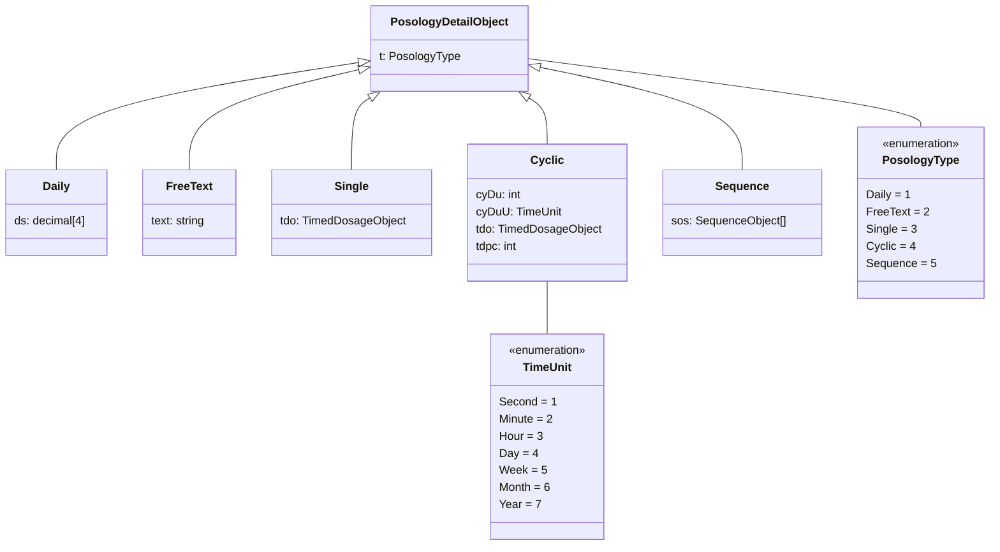
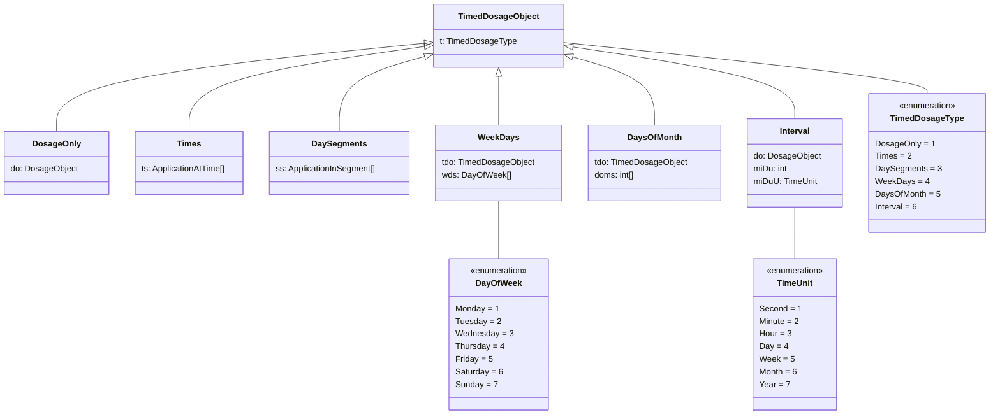
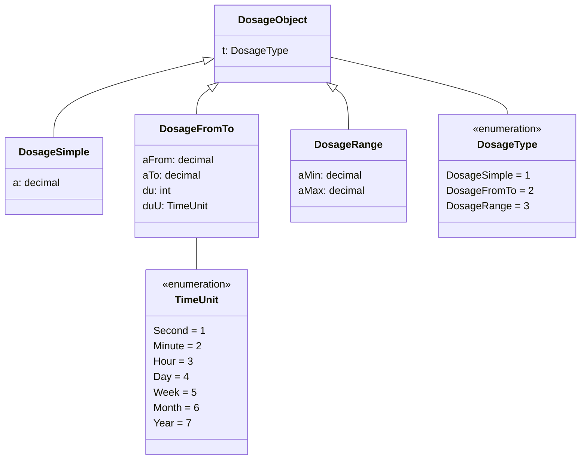
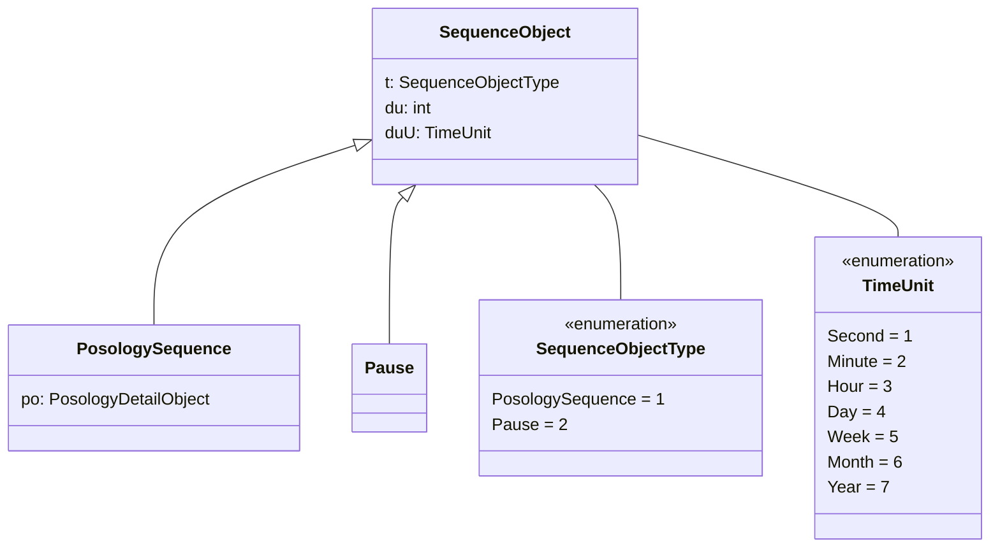
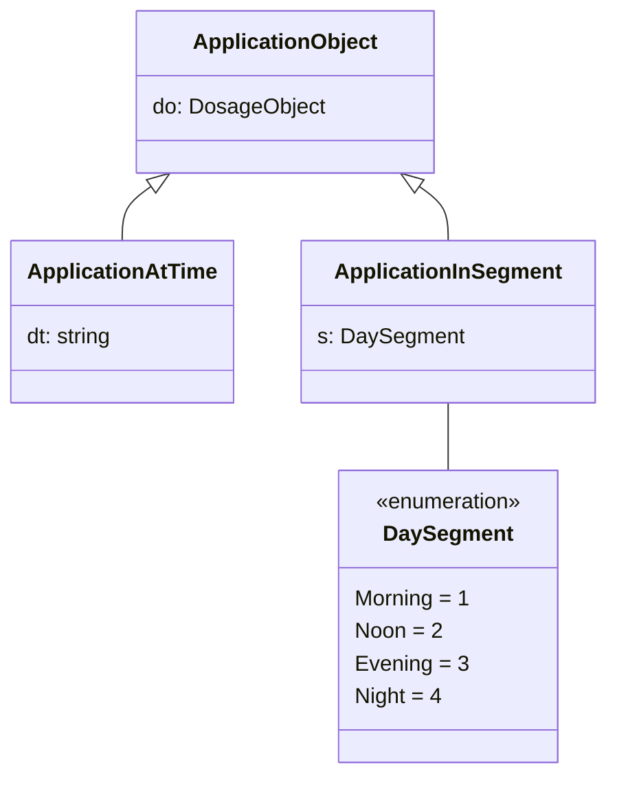

# eMedication Plan ChMed23A Posology

**Contact**

Geschäftsstelle IG eMediplan<br>
c/o Köhler, Stüdeli & Partner GmbH<br>
Amthausgasse 18, 3011 Bern<br>
Tel. +41 (0)31 560 00 24<br>
info@emediplan.ch

## Table of contents

- [Table of contents](#table-of-contents)
- [Introduction](#introduction)
- [Conventions](#conventions)
- [Overview](#overview)
- [Posology](#posology)
    - [Limitations and validations](#limitations-and-validations)
    - [Examples](#examples)
- [PosologyDetail objects](#posologydetail-objects)
    - [Daily](#daily)
    - [FreeText](#freetext)
    - [Single](#single)
    - [Cyclic](#cyclic)
    - [Sequence](#sequence)
- [TimedDosage objects](#timeddosage-objects)
    - [DosageOnly](#dosageonly)
    - [Times](#times)
    - [DaySegments](#daysegments)
    - [WeekDays](#weekdays)
    - [DaysOfMonth](#daysofmonth)
    - [Interval](#interval)
- [Dosage objects](#dosage-objects)
    - [DosageSimple](#dosagesimple)
    - [DosageFromTo](#dosagefromto)
    - [DosageRange](#dosagerange)
- [Sequence objects](#sequence-objects)
    - [PosologySequence](#posologysequence)
    - [Pause](#pause)
- [Application objects](#application-objects)
    - [ApplicationAtTime](#applicationattime)
    - [ApplicationInSegment](#applicationinsegment)
- [Value sets](#value-sets)
    - [Days of week](#days-of-week)
    - [Day segments](#day-segments)
    - [Relative to meal](#relative-to-meal)
    - [Time units](#time-units)

## Introduction

This document is an addition to the main specification of [CHMED23A](./README.md). It focuses on the topic of posology and describes how to use the *PosologyDetail* objects and its dependencies (*TimedDosage* objects, *Dosage* objects, *Sequence* objects and *Application* objects).

## Conventions

Please refer to this [document](./conventions.md) for conventions used in this specification.

## Overview


This overview shows the dependencies between the *PosologyDetail* objects, *TimedDosage* objects, *Sequence* objects, *Dosage* objects and *Application* objects.

The following table illustrates which *TimedDosage* object or *Sequence* object can/can't be used for a specific *PosologyDetail* object:


<table>
<tr>
  <th rowspan="2"><i><b>PosologyDetail</b></i> <b>object</b></th>
  <th colspan="6"><b><i>TimedDosage</i> object</b></th>
</tr>
<tr>
  <td>DosageOnly</td>
  <td>Times</td>
  <td>DaySegments</td>
  <td>WeekDays</td>
  <td>DaysOfMonth</td>
  <td>Interval</td>
</tr>
<tr>
  <td>Daily</td>
  <td>No</td>
  <td>No</td>
  <td>No</td>
  <td>No</td>
  <td>No</td>
  <td>No</td>
</tr>
<tr>
  <td>FreeText</td>
  <td>No</td>
  <td>No</td>
  <td>No</td>
  <td>No</td>
  <td>No</td>
  <td>No</td>
</tr>
<tr>
  <td>Single</td>
  <td><b>Yes</b></td>
  <td><b>Yes</b></td>
  <td><b>Yes</b></td>
  <td>No</td>
  <td>No</td>
  <td>No</td>
</tr>
<tr>
  <td>Cyclic</td>
  <td><b>Yes</b></td>
  <td><b>Yes</b></td>
  <td><b>Yes</b></td>
  <td><b>Yes, if CyDuU = week</b></td>
  <td><b>Yes, if CyDuU = month</b></td>
  <td><b>Yes</b></td>
</tr>
<tr>
  <td>Sequence</td>
  <td colspan="6"><b>Yes, within the Posology <i>Sequence</i> (part of <i>Sequence</i> object)</b></td>
</tr>
</table>


The following table illustrates which *TimedDosage* object, *Dosage* object or *Application* object can/can't be used for a specific *TimedDosage* object:

<table>
<tr>
  <th rowspan="2"><b><i>TimedDosage</i> objects</b></th>
  <th colspan="6"><b><i>TimedDosage</i> object</b></th>
  <th colspan="3"><b><i>Dosage</i> object</b></th>
  <th colspan="2"><b><i>Application</i> objects</b></th>
</tr>
<tr>
  <td>DosageOnly</td>
  <td>Times</td>
  <td>DaySegments</td>
  <td>WeekDays</td>
  <td>DaysOfMonth</td>
  <td>Interval</td>
  <td>DosageSimple</td>
  <td>DosageFromTo</td>
  <td>DosageRange</td>
  <td><p>AtTime</p>
    <p>Application</p></td>
  <td><p>Segment</p>
    <p>Application</p></td>
</tr>
<tr>
  <td>DosageOnly</td>
  <td>No</td>
  <td>No</td>
  <td>No</td>
  <td>No</td>
  <td>No</td>
  <td>No</td>
  <td><b>Yes</b></td>
  <td><b>Yes</b></td>
  <td><b>Yes</b></td>
  <td>No</td>
  <td>No</td>
</tr>
<tr>
  <td>Times</td>
  <td>No</td>
  <td>No</td>
  <td>No</td>
  <td>No</td>
  <td>No</td>
  <td>No</td>
  <td>No</td>
  <td>No</td>
  <td>No</td>
  <td><b>Yes</b></td>
  <td>No</td>
</tr>
<tr>
  <td>DaySegments</td>
  <td>No</td>
  <td>No</td>
  <td>No</td>
  <td>No</td>
  <td>No</td>
  <td>No</td>
  <td>No</td>
  <td>No</td>
  <td>No</td>
  <td>No</td>
  <td><b>Yes</b></td>
</tr>
<tr>
  <td>WeekDays</td>
  <td><b>Yes</b></td>
  <td><b>Yes</b></td>
  <td><b>Yes</b></td>
  <td>No</td>
  <td>No</td>
  <td><b>Yes</b></td>
  <td>No</td>
  <td>No</td>
  <td>No</td>
  <td>No</td>
  <td>No</td>
</tr>
<tr>
  <td>DaysOfMonth</td>
  <td><b>Yes</b></td>
  <td><b>Yes</b></td>
  <td><b>Yes</b></td>
  <td>No</td>
  <td>No</td>
  <td><b>Yes</b></td>
  <td>No</td>
  <td>No</td>
  <td>No</td>
  <td>No</td>
  <td>No</td>
</tr>
<tr>
  <td>Interval</td>
  <td>No</td>
  <td>No</td>
  <td>No</td>
  <td>No</td>
  <td>No</td>
  <td>No</td>
  <td><b>Yes</b></td>
  <td><b>Yes</b></td>
  <td><b>Yes</b></td>
  <td>No</td>
  <td>No</td>
</tr>
</table>

## Posology

The posology of a medicament describes **when**, which **quantity** of the medicament must be applied. Different kind of posologies can be specified with the available *PosologyDetail* objects, this chapter describes how.

A posology CAN contain a start and an end date for the treatment and MUST specify the type of the *PosologyDetail* object it contains.

<table>
<tr>
  <th rowspan="2"><b>Name</b></th>
  <th rowspan="2"><b>Type</b></th>
  <th colspan="2"><b>Usage</b></th>
  <th rowspan="2"><b>Description</b></th>
</tr>
<tr>
  <td>

  MP[^1]

  </td>
  <td>

  Rx[^2]

  </td>
</tr>
<tr>
  <td>dtFrom</td>
  <td>string</td>
  <td>O</td>
  <td>O</td>
  <td>

  From date (start date of medication treatment),

  format: yyyy-mm-ddThh:mm:ss+02:00 ([ISO 8601](http://en.wikipedia.org/wiki/ISO_8601) Combined date and time in UTC)
  (e.g. 2016-06-16T16:26:15+02:00)

  </td>
</tr>
<tr>
  <td>dtTo</td>
  <td>string</td>
  <td>O</td>
  <td>O</td>
  <td>

  To date (end date of medication treatment),

  format: yyyy-mm-ddThh:mm:ss+02:00 ([ISO 8601](http://en.wikipedia.org/wiki/ISO_8601) Combined date and time in UTC)
  (e.g. 2016-06-16T16:26:15+02:00)

  The _DtTo_ must be considered as inclusive.
  For example DtTo: 2015-05-01, the patient must apply the medicament also on 2015-05-01.

  </td>
</tr>
<tr>
  <td>inRes</td>
  <td>boolean</td>
  <td>O</td>
  <td>O</td>
  <td><p>Reserve medication </p>
    <p>True if in reserve, false otherwise. Default: false </p></td>
</tr>
<tr>
  <td>po</td>
  <td><i>PosologyDetail</i> object</td>
  <td>R</td>
  <td>R</td>
  <td>

  The <i>PosologyDetail</i> object contains the details of the posology.

  Please refer to [PosologyDetail objects](#posologydetail-objects).

  </td>
</tr>
<tr>
  <td>relMeal</td>
  <td>integer</td>
  <td>O</td>
  <td>O</td>
  <td>

  Indicates whether a medicament must be taken relative to a meal.

  Value set: [Relative to meal](#relative-to-meal)

  </td>
</tr>
<tr>
  <td>unit</td>
  <td>string</td>
  <td>R</td>
  <td>O</td>
  <td>

  The quantity unit. Mandatory if _Pos_ is defined.

  Allowed values (code representation, display values are not allowed):

  See [Unit](./terminology.md#unit)

  </td>
</tr>
<tr>
  <td>appInstr</td>
  <td>string</td>
  <td>O</td>
  <td>O</td>
  <td><p>Application instructions (further information on how to apply the medication, e.g. dissolve in a glass of
    water or fruit juice). </p>
    <p>Please note: For unstructured posology we recommend using the <i>Posology</i> object <i>FreeText</i> instead of
      <i>AppInstr</i>. </p></td>
</tr>
<tr>
  <td>roa</td>
  <td>string</td>
  <td>O</td>
  <td>O</td>
  <td>

  The route of administration (according to EDQM[^3])

  Allowed values (code representation, display values are not allowed):

  See [Route of Administration](./terminology.md#route-of-administration)

  </td>
</tr>
<tr>
  <td>moa</td>
  <td>string</td>
  <td>O</td>
  <td>O</td>
  <td>

  The method of administration (according to EDQM[^3])

  Allowed values (code representation, display values are not allowed):

  See [Method of Administration](./terminology.md#method-of-administration)

  </td>
</tr>
</table>

### Limitations and validations

- If both *dtFrom* and *dtTo* are set, the to date (*dtTo*) must be greater than the from date (*dtFrom*) or equal to the from date (*dtFrom*)

### Examples

```json5
{
  "dtFrom": "2023-07-13",
  "dtTo": "2023-08-13",
  "relMeal": 1,
  "inRes": false,
  "po": {
    /* … */
  },
  "unit": "Stk",
  "appInstr": "Dissolve in a glass of water or fruit juice.",
  "roa": "20053000",
  "moa": "19"
}
```

## PosologyDetail objects


Different types of *PosologyDetail* objects are available. E.g. the daily posology object can be used to easily define daily dosages for morning, noon, evening and night or a sequence can be used to specify a complex posology like 'take daily for 2 weeks, then take a break of 2 days”.

The chapters below will describe the structure of every available *PosologyDetail* object with examples.



The following table shows all *PosologyDetail* objects with their *PosologyDetail* object type:

|***PosologyDetail* object** |***PosologyDetail* object type** |
| - | - |
|Daily |1 |
|FreeText |2 |
|Single |3 |
|Cyclic |4 |
|Sequence |5 |

### Daily

Describes when (morning, noon, evening, night) and how much of a medicament must be applied daily, using a simple structure.

Note that the unit of the dosage specified is set on the medicament with the property *unit*.

<table>
<tr>
  <th rowspan="2"><b>Name</b></th>
  <th rowspan="2"><b>Type</b></th>
  <th colspan="2"><b>Usage</b></th>
  <th rowspan="2"><b>Description</b></th>
</tr>
<tr>
  <td>MP</td>
  <td>Rx</td>
</tr>
<tr>
  <td>t</td>
  <td>integer</td>
  <td>R</td>
  <td>R</td>
  <td>MUST be 1</td>
</tr>
<tr>
  <td>ds</td>
  <td>array of decimal</td>
  <td>R</td>
  <td>R</td>
  <td>

  The dosages specify the amount of the medicament to be applied in a day segment.

  Indexes:

  1: Morning

  2: Noon

  3: Evening

  4: Night

  </td>
</tr>
</table>

#### Limitations and validations

- Dosages must contain exactly four decimal values
- All dosages must be equal to or greater than 0

#### Examples

Take daily 1 in the morning and 2 in the evening.

```json5
{
  "t": 1, // Daily
  "ds": [
    1.5, // 1.5 (pills) in the morning
    0,
    2, // 2 pills in the evening
    0
  ]
}
```

### FreeText

Describes an unstructured posology consisting of free text.

<table>
<tr>
  <th rowspan="2"><b>Name</b></th>
  <th rowspan="2"><b>Type</b></th>
  <th colspan="2"><b>Usage</b></th>
  <th rowspan="2"><b>Description</b></th>
</tr>
<tr>
  <td>MP</td>
  <td>Rx</td>
</tr>
<tr>
  <td>t</td>
  <td>integer</td>
  <td>R</td>
  <td>R</td>
  <td>MUST be 2</td>
</tr>
<tr>
  <td>text</td>
  <td>string</td>
  <td>R</td>
  <td>R</td>
  <td>Free text describing the posology</td>
</tr>
</table>

#### Limitations and validations

- Length of text must be greater than 0

#### Examples

Free text.

```json5
{
  "t": 2, // Free text
  "text": "Take one pill. Wait one hour. If symptoms persist, take a second pill and wait 30 minutes. If symptoms persist, contact doctor."
}
```

### Single

Describes a single application of a medicament. With the *TimedDosage* object, there are several possibilities to specify when the single application takes place.

<table>
<tr>
  <th rowspan="2"><b>Name</b></th>
  <th rowspan="2"><b>Type</b></th>
  <th colspan="2"><b>Usage</b></th>
  <th rowspan="2"><b>Description</b></th>
</tr>
<tr>
  <td>MP</td>
  <td>Rx</td>
</tr>
<tr>
  <td>t</td>
  <td>integer</td>
  <td>R</td>
  <td>R</td>
  <td>MUST be 3</td>
</tr>
<tr>
  <td>tdo</td>
  <td><i>TimedDosage</i> object</td>
  <td>R</td>
  <td>R</td>
  <td>

  The <i>TimedDosage</i> object specifies the timing and dosage of a medicament to be applied.

  Please refer to [TimedDosage objects](#timeddosage-objects)

  </td>
</tr>
</table>

#### Limitations and validations

- The following *TimedDosage* objects are supported: *DosageOnly*, *Times*, *DaySegments*.
- Make sure the timed dosage specifies a unique dosage. This is not being enforced by the validation.

#### Examples

Take 1:

```json5
{
  "t": 3, // Single application
  "tdo": {
    "t": 1, // Dosage only
    "d": {
      "t": 1, // Simple dosage
      "a": 1 // Amount of 1
    }
  }
}
```

### Cyclic

Describes the application of a medicament at constant intervals.

<table>
<tr>
  <th rowspan="2"><b>Name</b></th>
  <th rowspan="2"><b>Type</b></th>
  <th colspan="2"><b>Usage</b></th>
  <th rowspan="2"><b>Description</b></th>
</tr>
<tr>
  <td>MP</td>
  <td>Rx</td>
</tr>
<tr>
  <td>t</td>
  <td>integer</td>
  <td>R</td>
  <td>R</td>
  <td>MUST be 4</td>
</tr>
<tr>
  <td>cyDuU</td>
  <td>integer</td>
  <td>R</td>
  <td>R</td>
  <td>

  The cycle duration unit specifies the time unit (hours, days etc.) <i>cyDu</i> will be interpreted with it.

  Value set: [Time units](#time-units)

  </td>
</tr>
<tr>
  <td>cyDu</td>
  <td>integer</td>
  <td>R</td>
  <td>R</td>
  <td>The duration of a cycle</td>
</tr>
<tr>
  <td>tdo</td>
  <td><i>TimedDosage</i> object</td>
  <td>R</td>
  <td>R</td>
  <td>

  The <i>TimedDosage</i> object specifies the timing and dosage of a medicament to be applied.

  Please refer to [TimedDosage objects](#timeddosage-objects)

  </td>
</tr>
<tr>
  <td>tdpc</td>
  <td>integer</td>
  <td>O</td>
  <td>O</td>
  <td><p>The timed dosages per cycle specifies how often the timed dosage must be repeated within the cycle. </p>
    <p>Default: 1</p>
    <p>Example: tdpc=2 if a medication must be applied twice a week without specifying when. </p></td>
</tr>
</table>

#### Limitations and validations

- The following *TimedDosage* objects are supported:
    - *DosageOnly*, *Times*, *DaySegments*, *Interval*
    - *WeekDays*: Supported if cycle duration unit is week
    - *DaysOfMonth*: Supported if cycle duration unit is month
- Cycle duration (*cyDu*) must be greater than 0
- Timed dosages per cycle (*tdpc*) must be greater than 0

#### Examples

1 pill twice a week:

```json5
{
  "t": 4, // Cyclic
  "cyDuU": 5, // weekly duration unit
  "cyDu": 5, // Cycle duration of 5 (weeks)
  "tdo": {
    "t": 1, // Dosage only
    "d": {
      "t": 1, // Simple dosage
      "a": 1 // Amount of 1
    }
  },
  "tdpc": 2 // take twice within cycle
}
```

### Sequence

Allows multiple posologies to be combined with a pause as a sequence.

<table>
<tr>
  <th rowspan="2"><b>Name</b></th>
  <th rowspan="2"><b>Type</b></th>
  <th colspan="2"><b>Usage</b></th>
  <th rowspan="2"><b>Description</b></th>
</tr>
<tr>
  <td>MP</td>
  <td>Rx</td>
</tr>
<tr>
  <td>t</td>
  <td>integer</td>
  <td>R</td>
  <td>R</td>
  <td>MUST be 5</td>
</tr>
<tr>
  <td>sos</td>
  <td>List of <i>Sequence</i> objects</td>
  <td>R</td>
  <td>R</td>
  <td>

  The ordered list of <i>Sequence</i> objects.

  Please refer to [Sequence objects](#sequence-objects)

  </td>
</tr>
</table>

#### Limitations and validations

- The list of *Sequence* objects must contain at least 1 element

#### Examples

Take daily 1 for 21 days, then take a break of 7 days

```json5
{
  "t": 5, // Sequence
  "sos": [
    {
      "t": 1, // Posology sequence
      "po": {
        "t": 4, // Cyclic
        "cyDuU": 4, // Daily cycle duration unit
        "cyDu": 1, // Take every 1 (day)
        "td": {
          "t": 1, // Dosage only
          "d": {
            "t": 1, // Simple dosage
            "a": 1 // Amount of 1
          }
        },
        "tdpc": 1 // take once within cycle
      },
      "duU": 4, // Daily duration unit
      "du": 21 // Duration of 21 (days)
    },
    {
      "t": 2, // Pause
      "duU": 4, // Daily duration unit
      "du": 7 // Duration of 7 (days)
    }
  ]
}
```

## TimedDosage objects

Different types of *TimedDosage* objects are available to specify the moment and amount of an application of a medicament. All *TimedDosage* objects must specify an amount to be applied. It is not mandatory to specify the moment of the application, but it is possible to set them precisely (time of day) or vaguely (day of week or month, day segment etc.).




The following table shows all *TimedDosage* objects with their *TimedDosage* object type:

|***TimedDosage* object** |***TimedDosage* object type** |
| - | - |
|DosageOnly |1 |
|Times |2 |
|DaySegments |3 |
|WeekDays |4 |
|DaysOfMonth |5 |
|Interval |6 |

### DosageOnly

Specifies a dosage without specifying a precise moment for taking.

<table>
<tr>
  <th rowspan="2"><b>Name</b></th>
  <th rowspan="2"><b>Type</b></th>
  <th colspan="2"><b>Usage</b></th>
  <th rowspan="2"><b>Description</b></th>
</tr>
<tr>
  <td>MP</td>
  <td>Rx</td>
</tr>
<tr>
  <td>t</td>
  <td>integer</td>
  <td>R</td>
  <td>R</td>
  <td>MUST be 1</td>
</tr>
<tr>
  <td>do</td>
  <td><i>Dosage</i> object</td>
  <td>R</td>
  <td>R</td>
  <td>

  The object specifies the dosage to be applied.

  Please refer to [Dosage objects](#dosage-objects)

  </td>
</tr>
</table>

#### Limitations and validations

- None

#### Examples

Take 1

```json5
{
  "t": 1, // Dosage only
  "do": {
    "t": 1, // Simple dosage
    "a": 1 // Amount of 1
  }
}
```

### Times

Specifies precise times when a medicament must be applied.

<table>
<tr>
  <th rowspan="2"><b>Name</b></th>
  <th rowspan="2"><b>Type</b></th>
  <th colspan="2"><b>Usage</b></th>
  <th rowspan="2"><b>Description</b></th>
</tr>
<tr>
  <td>MP</td>
  <td>Rx</td>
</tr>
<tr>
  <td>t</td>
  <td>integer</td>
  <td>R</td>
  <td>R</td>
  <td>MUST be 2</td>
</tr>
<tr>
  <td>ts</td>
  <td>list of <i>ApplicationAtTime</i></td>
  <td>R</td>
  <td>R</td>
  <td>

  Specifies the dosage to be applied at a certain time.

  Please refer to [ApplicationAtTime](#applicationattime)

  </td>
</tr>
</table>

#### Limitations and validations

- None

#### Examples

Take 1 at 08:00.

```json5
{
  "t": 2, // Times
  "ts": [
    {
      "dt": "08:00:00", // Time of day
      "do": {
        "t": 1, // Simple dosage
        "a": 1 // Amount of 1
      }
    }
  ]
}
```

### DaySegments

Specifies the day segment (morning, noon, evening, night) when a medicament must be applied.

<table>
<tr>
  <th rowspan="2"><b>Name</b></th>
  <th rowspan="2"><b>Type</b></th>
  <th colspan="2"><b>Usage</b></th>
  <th rowspan="2"><b>Description</b></th>
</tr>
<tr>
  <td>MP</td>
  <td>Rx</td>
</tr>
<tr>
  <td>t</td>
  <td>integer</td>
  <td>R</td>
  <td>R</td>
  <td>MUST be 3</td>
</tr>
<tr>
  <td>ss</td>
  <td>list of <i>ApplicationInSegment</i></td>
  <td>R</td>
  <td>R</td>
  <td>

  Specifies the dosage to be applied in a day segment.

  Please refer to [ApplicationInSegment](#applicationinsegment)

  </td>
</tr>
</table>

#### Limitations and validations

- None

#### Examples

Take 1 in the evening

```json5
{
  "t": 3, // day segments
  "ss": [
    {
      "s": 3, // Evening
      "do": {
        "t": 1, // Simple dosage
        "a": 1 // Amount of 1
      }
    }
  ]
}
```

### WeekDays

Specifies on which days of the week a medicament must be applied.

<table>
<tr>
  <th rowspan="2"><b>Name</b></th>
  <th rowspan="2"><b>Type</b></th>
  <th colspan="2"><b>Usage</b></th>
  <th rowspan="2"><b>Description</b></th>
</tr>
<tr>
  <td>MP</td>
  <td>Rx</td>
</tr>
<tr>
  <td>t</td>
  <td>integer</td>
  <td>R</td>
  <td>R</td>
  <td>MUST be 4</td>
</tr>
<tr>
  <td>wds</td>
  <td>list of integers</td>
  <td>R</td>
  <td>R</td>
  <td>

  The weekdays for which the timed dosage must be applied.

  Value set: [Days of week](#days-of-week)

  </td>
</tr>
<tr>
  <td>tdo</td>
  <td><i>TimedDosage</i> object</td>
  <td>R</td>
  <td>R</td>
  <td>

  The _TimedDosage_ object specifies the timing and dosage of a medicament to be applied.

  Please refer to [TimedDosage objects](#timeddosage-objects)

  </td>
</tr>
</table>

#### Limitations and validations

- At least one day of the week must be specified
- A day of the week may only be contained once in the list
- The following *TimedDosage* objects are supported for *tdo*: *DosageOnly*, *Times*, *DaySegments*.

#### Examples

Take 1 on Monday, Wednesday and Friday

```json5
{
  "t": 4, // Weekdays
  "wds": [1, 3, 5], // Monday, Wednesday, Friday
  "tdo": {
    "t": 1, // Dosage only
    "do": {
      "t": 1, // Simple dosage
      "a": 1 // Amount of 1
    }
  }
}
```

### DaysOfMonth

Specifies on which days of the month a medicament must be applied.

<table>
<tr>
  <th rowspan="2"><b>Name</b></th>
  <th rowspan="2"><b>Type</b></th>
  <th colspan="2"><b>Usage</b></th>
  <th rowspan="2"><b>Description</b></th>
</tr>
<tr>
  <td>MP</td>
  <td>Rx</td>
</tr>
<tr>
  <td>t</td>
  <td>integer</td>
  <td>R</td>
  <td>R</td>
  <td>MUST be 5</td>
</tr>
<tr>
  <td>doms</td>
  <td>list of integers</td>
  <td>R</td>
  <td>R</td>
  <td>The days of the month specify when the application(s) must occur.</td>
</tr>
<tr>
  <td>tdo</td>
  <td><i>TimedDosage</i> object</td>
  <td>R</td>
  <td>R</td>
  <td>

  The timed dosage object specifying the timing and dosage of a medicament to be applied.

  Please refer to [TimedDosage objects](#timeddosage-objects)

  </td>
</tr>
</table>

#### Limitations and validations

- At least one day must be specified in days (*DoMs*).
- A day of the month may only be contained once in the list.
- All days included must be greater than 0 and smaller than or equal to 28.
- The following *TimedDosage* objects are supported for TD: *DosageOnly*, *Times*, *DaySegments*.

#### Examples

Take 1 on the 1st and 15th of the month

```json5
{
  "t": 5, // Days of month
  "doms": [ 1, 15 ], // Specified days in month
  "tdo": {
    "t": 1, // Dosage only
    "do": {
      "t": 1, // Simple dosage
      "a": 1 // Amount of 1
    }
  }
}
```

### Interval

Specifies the application of a medicament with a minimal interval between two applications.

<table>
<tr>
  <th rowspan="2"><b>Name</b></th>
  <th rowspan="2"><b>Type</b></th>
  <th colspan="2"><b>Usage</b></th>
  <th rowspan="2"><b>Description</b></th>
</tr>
<tr>
  <td>MP</td>
  <td>Rx</td>
</tr>
<tr>
  <td>t</td>
  <td>integer</td>
  <td>R</td>
  <td>R</td>
  <td>MUST be 6</td>
</tr>
<tr>
  <td>do</td>
  <td><i>Dosage</i> object</td>
  <td>R</td>
  <td>R</td>
  <td>

  The object specifies the dosage to be applied.

  Please refer to [Dosage objects](#dosage-objects)

  </td>
</tr>
<tr>
  <td>miDu</td>
  <td>integer</td>
  <td>R</td>
  <td>R</td>
  <td>Minimal interval duration between two applications of a medicament</td>
</tr>
<tr>
  <td>miDuU</td>
  <td>integer</td>
  <td>R</td>
  <td>R</td>
  <td>

  The unit of the minimal interval duration

  Value set: [Time units](#time-units)

  </td>
</tr>
</table>

#### Limitations and validations

- Minimal interval duration (*miDu*) must be greater than 0.

#### Examples

Apply medication with a minimal interval of 6 hours between two applications.

```json5
{
  "t": 6, // Interval
  "do": {
    "t": 1, // Simple dosage
    "a": 1 // Amount of 1
  },
  "miDuU": 3, // Hours interval unit
  "miDu": 6 // Every 6 (hours)
}
```

## Dosage objects

*Dosage* objects describe the amount of a medication that must be applied. Note that the unit of the amount is specified by the *unit* set for the *Medicament*.




The following table shows all *Dosage* objects with their *Dosage* object type:

|***Dosage* object** |***Dosage* object type** |
| - | - |
|DosageSimple |1 |
|DosageFromTo |2 |
|DosageRange |3 |

### DosageSimple

Specifies a simple amount. E.g. 1 (pill) or 10 (ml).

<table>
<tr>
  <th rowspan="2"><b>Name</b></th>
  <th rowspan="2"><b>Type</b></th>
  <th colspan="2"><b>Usage</b></th>
  <th rowspan="2"><b>Description</b></th>
</tr>
<tr>
  <td>MP</td>
  <td>Rx</td>
</tr>
<tr>
  <td>t</td>
  <td>integer</td>
  <td>R</td>
  <td>R</td>
  <td>MUST be 1</td>
</tr>
<tr>
  <td>a</td>
  <td>decimal</td>
  <td>R</td>
  <td>R</td>
  <td>The amount to be applied</td>
</tr>
</table>

#### Limitations and validations

- Amount (*a*) must be greater than 0

#### Examples

Take 1.

```json5
{
  "t": 1, // Simple dosage
  "a": 1 // Amount of 1
}
```

### DosageFromTo

Specifies how a dosage changes during time. This can be e.g. used for infusions.

<table>
<tr>
  <th rowspan="2"><b>Name</b></th>
  <th rowspan="2"><b>Type</b></th>
  <th colspan="2"><b>Usage</b></th>
  <th rowspan="2"><b>Description</b></th>
</tr>
<tr>
  <td>MP</td>
  <td>Rx</td>
</tr>
<tr>
  <td>t</td>
  <td>integer</td>
  <td>R</td>
  <td>R</td>
  <td>MUST be 2</td>
</tr>
<tr>
  <td>aFrom</td>
  <td>decimal</td>
  <td>R</td>
  <td>R</td>
  <td>The amount from specifies the start amount</td>
</tr>
<tr>
  <td>aTo</td>
  <td>decimal</td>
  <td>R</td>
  <td>R</td>
  <td>The amount to specifies the end amount</td>
</tr>
<tr>
  <td>duU</td>
  <td>integer</td>
  <td>R</td>
  <td>R</td>
  <td>

  The unit of the duration

  Value set: [Time units](#time-units)

  </td>
</tr>
<tr>
  <td>du</td>
  <td>integer</td>
  <td>R</td>
  <td>R</td>
  <td>The duration</td>
</tr>
</table>

#### Limitations and validations

- Amount from (*aFrom*) must be greater than or equal to 0
- Amount to (*aTo*) must be greater than the amount from (*aFrom*)
- Duration (*du*) must be greater than 0

#### Examples

Start with a dosage of 5, end with a dosage of 10 during a time interval of 45 minutes.

```json5
{
  "t": 2, // From/to dosage
  "aFrom": 5, // Start amount is 5
  "aTo": 10, // End amount is 10
  "duU": 2, // Duration unit is minutes
  "du": 45 // Duration is 45 (minutes)
}
```

### DosageRange

With a dosage range a minimum and a maximum amount must be specified.

<table>
<tr>
  <th rowspan="2"><b>Name</b></th>
  <th rowspan="2"><b>Type</b></th>
  <th colspan="2"><b>Usage</b></th>
  <th rowspan="2"><b>Description</b></th>
</tr>
<tr>
  <td>MP</td>
  <td>Rx</td>
</tr>
<tr>
  <td>t</td>
  <td>integer</td>
  <td>R</td>
  <td>R</td>
  <td>MUST be 3</td>
</tr>
<tr>
  <td>aMin</td>
  <td>decimal</td>
  <td>R</td>
  <td>R</td>
  <td>The minimum amount of a medication that must be applied</td>
</tr>
<tr>
  <td>aMax</td>
  <td>decimal</td>
  <td>R</td>
  <td>R</td>
  <td>The maximum amount of a medication that must be applied</td>
</tr>
</table>

#### Limitations and validations

- Minimum amount (*aMin*) must be greater than 0
- Maximum amount (*aMax*) must be greater than *aMin*

#### Examples

Take min 1 and max 3.

```json5
{
  "t": 3, // Dosage range
  "aMin": 1.0, // Minimum amount of 1
  "aMax": 3.0 // Maximum amount of 3
}
```

## Sequence objects

*Sequence* objects can be used to specify a sequence of posologies that have to be respected in the correct order and can possibly be repeated.

Every sequence specifies its duration (including the unit).



The following table shows all *Sequence* objects with their *Sequence* object type:

|***Sequence* object** |***Sequence* object type** |
| - | - |
|PosologySequence |1 |
|Pause |2 |

### PosologySequence

Wraps any type of *PosologyDetail* object in order to create a sequence.

<table>
<tr>
  <th rowspan="2"><b>Name</b></th>
  <th rowspan="2"><b>Type</b></th>
  <th colspan="2"><b>Usage</b></th>
  <th rowspan="2"><b>Description</b></th>
</tr>
<tr>
  <td>MP</td>
  <td>Rx</td>
</tr>
<tr>
  <td>t</td>
  <td>integer</td>
  <td>R</td>
  <td>R</td>
  <td>MUST be 1</td>
</tr>
<tr>
  <td>du</td>
  <td>integer</td>
  <td>R</td>
  <td>R</td>
  <td>The duration of the sequence</td>
</tr>
<tr>
  <td>duU</td>
  <td>integer</td>
  <td>R</td>
  <td>R</td>
  <td>

  The duration unit used to interpret the duration (<i>du</i>) of the sequence

  Value set: [Time units](#time-units)

  </td>
</tr>
<tr>
  <td>po</td>
  <td><i>PosologyDetail</i> Object</td>
  <td>R</td>
  <td>R</td>
  <td>

  The <i>PosologyDetail</i> object

  Please refer to [PosologyDetail objects](#posologydetail-objects)

  </td>
</tr>
</table>

#### Limitations and validations

- Duration (*du*) must be greater than 0

#### Examples

Take 1 daily for 21 days

```json5
{
  "t": 1, // Sequence
  "po": {
    "t": 4, // Cyclic
    "cyDuU": 4, // Unit is day
    "cyDu": 1, // Cacle lasts 1 (day)
    "tdo": {
      "t": 1, // Dosage only
      "do": {
        "t": 1, // Simple dosage
        "a": 1 // Amount of 1
      }
    },
    "tdpc": 1
  },
  "duU": 4, // Unit is day
  "du": 21 // Sequence lasts 21 (days)
}
```

### Pause

Specifies a duration of a break where the medication doesn't have to be applied.

<table>
<tr>
  <th rowspan="2"><b>Name</b></th>
  <th rowspan="2"><b>Type</b></th>
  <th colspan="2"><b>Usage</b></th>
  <th rowspan="2"><b>Description</b></th>
</tr>
<tr>
  <td>MP</td>
  <td>Rx</td>
</tr>
<tr>
  <td>t</td>
  <td>integer</td>
  <td>R</td>
  <td>R</td>
  <td>MUST be 2</td>
</tr>
<tr>
  <td>du</td>
  <td>integer</td>
  <td>R</td>
  <td>R</td>
  <td>The duration of the sequence</td>
</tr>
<tr>
  <td>duU</td>
  <td>integer</td>
  <td>R</td>
  <td>R</td>
  <td>

  The duration unit used to interpret the duration (<i>du</i>) of the sequence

  Value set: [Time units](#time-units)

  </td>
</tr>
</table>

#### Limitations and validations

- Duration (*du*) must be greater than 0

#### Examples

Break of 7 days.

```json5
{
  "t": 2, // Pause
  "duU": 4, // Unit is day
  "du": 7 // Pause lasts 7 (days)
}
```

## Application objects

Application objects specify a dosage that must be applied at certain times; either at a precise time or in a day's segment (morning, noon, evening or night).



Note that *Application* objects do not include a type, as all other objects do. This is because *Application* objects can't be generically added to their parent, but are always explicitly typed. A *TimedDosage* object of the type *Times* must contain a list of *ApplicationAtTime* and one of the type *DaySegments* must contain a list of *ApplicationInSegment*.

### ApplicationAtTime

Specifies a precise moment in time when a medicament must be applied.

<table>
<tr>
  <th rowspan="2"><b>Name</b></th>
  <th rowspan="2"><b>Type</b></th>
  <th colspan="2"><b>Usage</b></th>
  <th rowspan="2"><b>Description</b></th>
</tr>
<tr>
  <td>MP</td>
  <td>Rx</td>
</tr>
<tr>
  <td>do</td>
  <td><i>Dosage</i> Object</td>
  <td>R</td>
  <td>R</td>
  <td>The object specifies the dosage to be applied.</td>
</tr>
<tr>
  <td>dt</td>
  <td>string</td>
  <td>R</td>
  <td>R</td>
  <td><p>Time of day when the medicament must be applied (hh:mm:ss). The time applies to the time zone of Switzerland:
    GMT+2 (summer time) or GMT+1 (winter time). </p>
    <p>The time format hh:mm is also supported (e.g. 08:00). </p></td>
</tr>
</table>

#### Limitations and validations

- *dt* must be equal to or greater than 00:00:00 and smaller than or equal to 23:59:59

#### Examples

Take 1 at 08:00

```json5
{
  "dt": "08:00:00", // Take at 8 in the morning
  "do": {
    "t": 1, // Simple dosage
    "a": 1 // Amount of 1
  }
}
```

### ApplicationInSegment

Specifies a day segment (morning, noon, evening or night) when a medicament must be applied.

<table>
<tr>
  <th rowspan="2"><b>Name</b></th>
  <th rowspan="2"><b>Type</b></th>
  <th colspan="2"><b>Usage</b></th>
  <th rowspan="2"><b>Description</b></th>
</tr>
<tr>
  <td>MP</td>
  <td>Rx</td>
</tr>
<tr>
  <td>do</td>
  <td><i>Dosage</i> Object</td>
  <td>R</td>
  <td>R</td>
  <td>The object specifies the dosage to be applied.</td>
</tr>
<tr>
  <td>s</td>
  <td>integer</td>
  <td>R</td>
  <td>R</td>
  <td>

  The day segment

  Value set: [Day segments](#day-segments)

  </td>
</tr>
</table>

#### Limitations and validations

- None

#### Examples

Take 1 in the evening

```json5
{
  "s": 3, // evening
  "do": {
    "t": 1, // Simple dosage
    "a": 1 // Amount of 1
  }
}
```

## Value sets

The ChMed23A uses proprietary value sets described in this chapter.

### Days of week

Specifies a day of the week.

|**Name** |**Value (integer)** |
| - | - |
|Monday |1 |
|Tuesday |2 |
|Wednesday |3 |
|Thursday |4 |
|Friday |5 |
|Saturday |6 |
|Sunday |7 |

### Day segments

Specifies a day segment.

|**Name** |**Value (integer)** |
| - | - |
|Morning |1 |
|Noon |2 |
|Evening |3 |
|Night |4 |

### Relative to meal

Specifies whether a medicament must be taken relative to a meal.

|**Name** |**Value (integer)** |
| - | - |
|Before |1 |
|During (includes also “immediately with the meal” and “at the beginning of the meal”) |2 |
|After |3 |
|Empty stomach |4 |
|With a high-fat meal |5 |
|With a light meal |6 |
|With a main meal |7 |

### Time units

Specifies the available time units.

|**Name** |**Value (integer)** |
| - | - |
|Second |1 |
|Minute |2 |
|Hour |3 |
|Day |4 |
|Week |5 |
|Month |6 |
|Year |7 |


[^1]: MP: MedicationPlan corresponds to `medType: 1` of the Medication object (see [CHMED23A](./README.md))
[^2]: Rx: Prescription corresponds to `medType: 2` of the Medication object (see [CHMED23A](./README.md))
[^3]: EDQM: European Directorate for the Quality of Medicines & HealthCare
